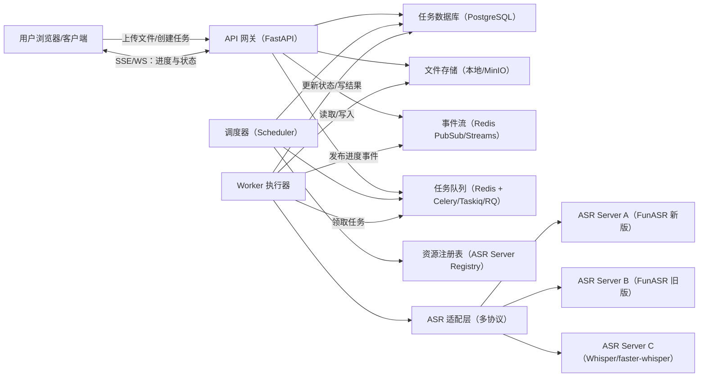

# ASR 任务管理器（中转适配层）架构与技术选型调研报告（草案）

日期：2026-02-26  
范围：集中式、离线/批处理为主的音视频转写任务管理与多 ASR 资源调度；**不包含**大模型摘要能力（预留扩展点）

---

## 0. 结论摘要（先读这一页）

**推荐起步架构（方案 B：服务端 + 任务队列 + 调度器 + 适配层）**

- **后端**：Python + FastAPI（REST + SSE/WebSocket）  
- **任务与调度**：Celery / Taskiq / RQ（三选一；起步更推荐 Taskiq 或 RQ，简单；需要复杂路由与生态再上 Celery）  
- **缓存/队列**：Redis（broker + 进度事件 + 分布式锁）  
- **数据库**：PostgreSQL（起步可 SQLite，但多用户与并发下建议尽早上 PG）  
- **文件存储**：本地磁盘（MVP）→ MinIO/S3（生产）  
- **媒体信息解析**：ffprobe（FFmpeg）统一抽取时长、编码、分辨率、音轨信息  
- **ASR 适配层**：面向“统一任务接口”，向下适配 FunASR 新/旧协议与其他 ASR（Whisper/faster-whisper 等）  
- **前端**：先用轻量 Web（React/Vue）做上传 + 任务列表 + 进度；后续扩展摘要/检索

**为什么这样做**
- 你们的核心难点不是“ASR 模型本身”，而是：**多用户输入 → 统一任务编排 → 多异构 ASR 资源调度 → 可观测进度/ETA → 文件与临时资源治理**。
- 业界常见做法是把“任务编排与资源调度”与“具体推理服务/ASR 服务”分离；推理服务可独立扩容、替换协议。  
- 相关开源项目已经验证：**FastAPI 做 API 层 + Celery/RQ 做异步 worker + 通过消息队列/事件发布进度**是可行路径；以及 Whisper/FunASR 生态里已有多个可复用的 server/adapter 示例（见调研）。

---

## 1. 背景与需求拆解

### 1.1 目标（Goals）
- 作为 **ASR 任务中转适配层**，支持多个用户并行提交离线转写任务。
- 后端能对接 **多个 ASR 服务器资源池**（可能协议不同、算力不同、并发不同）。
- 具备 **任务状态、进度、ETA、失败重试、取消** 等能力，并把结果/状态回传给 UI。
- 统一文件编号与存储，提供可追溯的任务数据库与临时文件生命周期管理。

### 1.2 非目标（Non-Goals，当前不做）
- 转写后的大模型摘要/润色/结构化（仅在架构中预留扩展点）。
- 高优先级插队/抢占式调度（本期先不做，只预留字段与接口）。
- 端到端实时流式转写（本期以离线/批处理为主；可预留“分片流式”进度能力）。

### 1.3 约束与假设（用于本报告）
- 文件规模：以分钟级到小时级音视频为主，可能包含多种编码格式。
- ASR 服务器：既可能是 FunASR WebSocket 服务，也可能是 Whisper 系服务（HTTP/WS/自定义）。
- UI：优先满足“上传/任务列表/进度/结果下载或查看”，不追求复杂审阅与协作。

---

## 2. 关键挑战（决定成败的点）

1. **异构 ASR 协议适配**：同一任务模型向下适配不同协议（FunASR 新/旧、HTTP/WS、流式/非流式）。
2. **资源建模与调度**：服务器数量、并发槽位、单位吞吐（RTF）、排队时间与 ETA 预估。
3. **进度可观测**：没有“天然进度”的 ASR 服务，需要通过分片、轮询、或服务端回调事件统一表达。
4. **文件与临时资源治理**：统一编号、落盘/对象存储、转码/切分中间产物、清理策略。
5. **多用户隔离**：任务可见性、配额（并发/容量）、权限与审计。

---

## 3. GitHub 开源项目调研（可直接借鉴的点）

> 说明：这里选择与你们需求“中转层 + 服务化 + 多资源/多协议适配”最贴近的项目与底座库；并不追求把 ASR 代码全复制。

### 3.1 ASR 服务与封装示例

1) **FunASR 主仓库**（模型与推理示例、生态入口）  
- 项目：`alibaba-damo-academy/FunASR`  
- 借鉴点：FunASR 的服务形态与生态组件入口、协议演进线索。  
- 链接：[FunASR](https://github.com/alibaba-damo-academy/FunASR)

2) **FunASR WebSocket 服务示例（wss server）**  
- 项目：`jinfagang/funasr-wss-server`（非官方，但常见参考）  
- 借鉴点：WS 交互方式、如何组织请求/响应、与客户端对接方式。  
- 链接：[funasr-wss-server](https://github.com/jinfagang/funasr-wss-server)

3) **Whisper ASR Webservice（FastAPI）**  
- 项目：`ahmetoner/whisper-asr-webservice`  
- 借鉴点：把 Whisper 封装成可部署的 Web 服务；支持多后端（`openai/whisper`、`faster-whisper`、`whisperX`），体现“同一 API → 多推理后端”的思路。  
- 链接：[whisper-asr-webservice](https://github.com/ahmetoner/whisper-asr-webservice)

4) **Whisper 转写 + 说话人分离的微服务实践（含 Celery）**  
- 项目：`linto-ai/whisper-timestamped-diarization`  
- 借鉴点：明确提到可在 **微服务架构**中部署，并有 **message broker connector / celery worker** 的组织方式，可参考“任务队列 + worker”的落地模式。  
- 链接：[whisper-timestamped-diarization](https://github.com/linto-ai/whisper-timestamped-diarization)

5) **faster-whisper 的“API + 队列 + SSE”微服务栈示例**  
- 项目：`nirnaim/faster-whisper-server`  
- 借鉴点：把“薄 API 层 + Celery/Redis 后台队列 + SSE 推送 partial/final”打通，且提供模型池/多副本等工程化细节；很贴近你们“离线为主 + 进度展示 + 可扩容”的方向。  
- 链接：[faster-whisper-server](https://github.com/nirnaim/faster-whisper-server)

6) **OpenAI API 兼容的 faster-whisper 服务（SSE/WS/动态模型加载）**  
- 项目：`etalab-ia/faster-whisper-server`  
- 借鉴点：提供 OpenAI API 兼容形态、支持 SSE 流式与 WebSocket live transcription，且有动态模型加载/卸载思路；适合你们未来“多后端统一接口”的演进方向。  
- 链接：[etalab-ia/faster-whisper-server](https://github.com/etalab-ia/faster-whisper-server)

7) **分片录音/上传 + 队列转写 + 最终汇总的端到端 Demo**  
- 项目：`hellguz/MeetScribe`  
- 借鉴点：前端把音频切成小块上传，后端把每个 chunk 派到 Redis/Celery，转写结果落库并在 UI 侧实时预览；该“chunk 化”模式也可用于你们的离线大文件转写（用于更细粒度进度与失败重试）。  
- 链接：[MeetScribe](https://github.com/hellguz/MeetScribe)

### 3.2 你们已有项目的复用价值：`funasr-client-python`（强相关，建议直接吸收）

你们给的项目：`wangminle/funasr-client-python`（Tkinter GUI 客户端）对本次“ASR 任务管理器”的价值不在 UI，而在于它已经把 **FunASR 新旧 WebSocket 协议差异**与 **服务端能力探测/测速/超时兜底** 做成了可复用模块，能直接降低我们“适配层 + 资源评估”的研发风险。

**可以直接借鉴/复用的点（对应到任务管理器的模块）**
- **协议适配层（Adapter）**：项目里实现了协议适配模块（文档中称 `protocol_adapter.py`），把“消息构建、结果解析、结束判定”统一起来，尤其解决了“新版 runtime 离线模式 `is_final` 语义变化导致等待卡死”的问题；这部分建议抽成你们新项目的 `FunASRWebSocketAdapter`。  
- **服务端能力探测（Registry/Health）**：项目里实现了服务端点探测模块（文档中称 `server_probe.py`），把探测做了分级（仅连接 / 离线轻量 / 2pass 完整），输出 `ServerCapabilities`（是否可达、支持模式、时间戳能力、对 `is_final` 语义的最佳努力推断），并且支持探测缓存（24 小时）。这可以直接映射到任务管理器的“资源注册表”与健康检查。  
- **测速与 ETA 思路**：项目里有“上传速度 + 转写速度测试”“按文件真实时长动态估算等待超时”的机制（并带兜底策略）；这正是你们想要的“每 4 小时评估一次服务端点性能 → 用于派单与 ETA”。  
- **兜底策略与稳定性经验**：无法获取时长时固定等待窗口、参数下发失败降级重试、连接竞态修复、日志轮转、配置原子写入、探测结果缓存等，这些都属于“线上会踩坑的工程细节”，建议在新项目设计中直接继承。

**建议的吸收方式（不建议整仓复刻）**
- 把该项目中与 GUI 无关的模块，按“库”的方式迁移/重写到新仓库：  
  - 协议适配模块（文档中称 `protocol_adapter.py`）→ 新项目 `asr_adapters/funasr_ws_adapter.py`（内部实现可参考其结束判定与宽容解析）  
  - 探测模块（文档中称 `server_probe.py`）→ 新项目 `asr_registry/funasr_probe.py`（用于周期性探测与能力缓存）  
- 保留其“分级探测 + 探测缓存 + 最佳努力推断”的思想，但把落地点从“GUI 展示”改为“调度器决策输入”：  
  - `reachable/responsive` 用于健康剔除  
  - `supports_offline/2pass` 用于能力过滤  
  - `is_final_semantics` 用于适配层的结束判定策略选择（或直接沿用适配器内置策略）

链接：[funasr-client-python](https://github.com/wangminle/funasr-client-python)

### 3.2 调度/异步任务底座（Python）

你们要解决的是“离线任务编排”，ASR 只是 worker 的一种执行器；因此建议直接复用成熟队列体系：

- **Celery**：生态最大，适合复杂路由、重试、结果后端；但概念较多、配置较重。  
  - 链接：[Celery](https://github.com/celery/celery)
- **RQ（Redis Queue）**：轻量、易上手，适合 MVP。  
  - 链接：[rq](https://github.com/rq/rq)
- **Taskiq**：更现代的异步任务框架，API 简洁，适合 FastAPI 体系。  
  - 链接：[taskiq](https://github.com/taskiq-python/taskiq)

---

## 4. 业界/大厂相关参考（与“离线批处理/推理服务化/资源利用率”相关）

> 这些材料的价值在于：它们讨论的是“服务化推理、批处理与资源隔离”，对应你们的调度与资源建模问题。

- **Google Cloud Speech-to-Text（Batch Recognize）**：长音频/离线转写的批处理 API 形态参考。  
  - 链接：[Batch Recognize](https://cloud.google.com/speech-to-text/docs/batch-recognize)
- **NVIDIA Triton Inference Server（Dynamic Batching）**：推理服务端常用的吞吐优化手段；如果未来你们把 ASR 统一到 Triton/Ray 之上，这部分概念很关键。  
  - 链接：[Triton Dynamic Batching](https://github.com/triton-inference-server/server/blob/main/docs/user_guide/model_configuration.md#dynamic-batcher)
- **Ray Serve（Batching）**：把“请求批处理 + 服务化 + 扩缩容”抽象成工程能力，适合未来多模型/多任务平台化。  
  - 链接：[Ray Serve Batching](https://docs.ray.io/en/latest/serve/advanced-guides/dyn-req-batch.html)
- **NVIDIA MIG（GPU 资源隔离）**：当你们有 GPU 服务器池并需要多租户隔离时，可参考这种硬件层的隔离能力。  
  - 链接：[MIG User Guide](https://docs.nvidia.com/datacenter/tesla/mig-user-guide/)

---

## 5. 架构方案备选（2-3 种）与推荐

### 方案 A：单体应用 + 本地并发（最快做出来）
- 结构：FastAPI + 本地线程/进程池 + SQLite + 本地文件
- 优点：开发最快、依赖少、调试简单
- 缺点：多 ASR 服务器调度、任务可靠性、水平扩展、事件推送会较快遇到瓶颈
- 适用：PoC / 单机、小团队内部自用

### 方案 B（推荐）：API 服务 + 任务队列 + 调度器 + ASR 适配层
- 结构：FastAPI（API/UI 网关） + Redis（队列/事件） + Worker（执行） + Scheduler（分发） + Postgres（状态） + 文件存储
- 优点：清晰分层；可横向扩 worker；可逐步引入更复杂调度；对接多协议最自然
- 缺点：组件更多（Redis/PG），需要基础运维与可观测性
- 适用：你们描述的“集中式、多用户、多资源池”

### 方案 C：K8s + Ray Serve/Triton 的推理平台化（中长期）
- 结构：统一推理服务层（Ray Serve/Triton）+ 任务编排层 + 对象存储 + 可观测性全家桶
- 优点：吞吐与扩展更强，易于承载多模型/多任务
- 缺点：建设成本高，不适合起步阶段
- 适用：ASR 之外还要做多模态/LLM/多任务平台，且有 SRE 能力

---

## 6. 推荐架构（方案 B）详细设计

### 6.1 组件与数据流

### 6.2 核心接口边界（推荐的“统一任务模型”）

**统一任务（Task）**建议至少包含：
- `task_id`：全局唯一（雪花/UUID/时间+随机均可）
- `tenant_id/user_id`：多用户隔离
- `input_file_id`：输入文件实体
- `status`：`PENDING/RUNNING/SUCCEEDED/FAILED/CANCELED`
- `priority`：预留（本期可固定为 0）
- `asr_backend`：调度后选择的后端类型/实例
- `progress`：0~100（或 `processed_seconds/total_seconds`）
- `eta_seconds`：预估剩余
- `result_uri`：结果存储位置（json/txt/srt）
- `error_code/error_message`：失败归因

**ASR 适配层（Adapter）**对上提供统一方法（概念接口）：
- `submit(task, media_path) -> backend_job_id`
- `poll(backend_job_id) -> {status, progress?, partial_result?}`
- `cancel(backend_job_id)`
- `fetch_result(backend_job_id) -> result_files`

> 说明：不同 ASR 服务对“进度”的支持程度差异很大。统一表达时，建议采用“**媒体时长分片** + **任务阶段**”的组合进度（例如：`PREPARE 5%`、`UPLOAD 10%`、`ASR 10~95%`、`POST 95~100%`）。

### 6.3 资源建模与监测（ASR Server Registry）

为实现动态分发，需要把每台 ASR 服务器建模成“可用槽位”的资源：
- `server_id / host / protocol_version`
- `capacity_slots`：最大并发（线程/进程/会话）
- `available_slots`：实时可用
- `rtf`：Real-Time Factor（处理 1 秒音频耗时 / 1 秒），用于 ETA
- `health`：心跳、错误率、超时率
- `capabilities`：支持格式、语言、是否支持说话人分离、是否支持流式等

监测方式（从简单到复杂）：
1) **主动心跳 + 预配置 capacity**：MVP 推荐，稳定可控  
2) **worker 侧观测**：把真实耗时回写，动态更新 `rtf`  
3) **服务端导出 metrics**：Prometheus + dashboard（后续）

### 6.4 调度策略（v1：简单顺序并发）

先满足“能跑 + 不浪费资源”，不做抢占：
- 队列策略：按 `created_at` FIFO；可按 `tenant_id` 做简单公平（例如轮询 tenant）
- 分配策略：
  1) 过滤出满足能力（协议/语言/特性）的服务器集合
  2) 选择 `available_slots > 0` 且 `eta` 最小的 server
  3) 将任务绑定到 server，推入该 server 对应的执行队列（或在任务中写入路由键）
- ETA 估计：
  - 读取媒体 `duration_seconds`
  - 根据 server 的 `rtf` 粗估 `asr_time = duration * rtf`
  - 加上队列前置任务的估算：`queue_time = sum(duration_i) * rtf / slots`
  - `eta = queue_time + asr_time + overhead`

> 后续插队机制：只需引入 `priority` 与“高优先级队列”，并在调度器中调整出队规则；worker 不必大改。

### 6.4.1 容量与 SLA 粗算（基于当前已知规模）

你们给出的规模假设：
- 初期：每天约 **100** 个任务，单任务 **1~3 小时**
- 稳定后：每天约 **500** 个任务，单任务 **1~3 小时**
- ASR 资源：总并发线程（槽位）约 **50**

为了做容量估算，需要一个关键指标：**RTF（Real-Time Factor）**  
定义：`RTF = 处理耗时 / 音频时长`（RTF=1 表示实时；RTF=0.5 表示 2 倍实时速度；RTF=2 表示 0.5 倍实时速度）

用一个“保守但常用”的平均时长假设做粗算：平均每任务 2 小时音频：
- 初期总音频量：`100 * 2 = 200 小时/天`
- 稳定后总音频量：`500 * 2 = 1000 小时/天`

如果希望 **24 小时内处理完当天所有任务**，则需要总体“实时倍速”至少为：
- 初期：`200 / 24 = 8.3x`
- 稳定后：`1000 / 24 = 41.7x`

若总并发槽位 `N=50`，则需要满足：`N / RTF >= 41.7`（稳定后目标）  
得到 **稳定后的 RTF 上限**：`RTF <= 50 / 41.7 ≈ 1.2`

解释：
- 如果你们的 ASR 服务整体能做到 **接近实时（RTF≈1）或更快（RTF<1）**，那么 50 槽位理论上能支撑 500 任务/天的规模在 24h 内清空。
- 如果实际 RTF 在 **1.5~2.5**（不少 CPU-only 或重模型场景可能出现），那么就需要：更多槽位、更多服务器、或者引入更激进的优化（GPU/量化/动态 batching/更小模型/切分并行等）。

如果你们的业务期望是“**文件头一天准备好，第二天早上要出结果**”，例如要求 **12 小时窗口内清空**，稳定后需要的倍速为：`1000/12=83.3x`，此时 `RTF <= 50/83.3 ≈ 0.6`（需要明显快于实时）。  
因此建议你们明确一个最小 SLA：**T+0（当天）**、**T+1（次日）**，以及窗口（12h/16h/24h）。这会直接决定是否必须上 GPU 与 batching。

### 6.4.2 基于你们确认的 SLA：12h 清空（建议的工程护栏）

你们已确认目标是：**稳定后 500 任务/天，希望 12 小时内清空**，且“算力可做到（RTF 能跟上）”。为了把这个目标稳稳落地，建议在 v1 就加入以下“护栏”（不复杂，但很关键）：

- **必须落地 RTF 的在线估计**：每个 `server_id` 维护滚动窗口 `rtf_p50/rtf_p90`，调度用 `p90` 做保守 ETA（避免少数慢任务拖垮窗口）。  
- **模型预热与长任务保护**：窗口开始前预热模型/加载权重；对 3h 长任务设置 `max_runtime` 与心跳，避免“卡死占槽”。  
- **长文件切分（本期不做）**：你们已明确 v1 不做长文件切分，以降低复杂度与容错面。后续若需要更细粒度进度/更快失败重试，再单独评估引入（需要额外处理：边界拼接、重复/漏转写、分片一致性与恢复）。  
- **I/O 与上传链路不要成为瓶颈**：12h 清空时，瓶颈经常不是 ASR，而是：大文件上传、转码、读写与网络。建议尽早采用“可续传上传（tus）/预签名直传 + 后端落库”，以及把转码/切分也做成异步任务阶段。  
- **窗口化调度模式**：既然文件“头一天准备好”，可以设计为“夜间/固定窗口批处理”：提前入库+抽 metadata，窗口开始时统一调度；这样 ETA 更稳定，资源利用率更高。

### 6.4.3 不切分长文件时，如何最大化算力利用率（v1 推荐调度算法）

你们的直觉是对的：**只要一开始就能拿到文件时长 + 每个服务端点的吞吐评估（RTF/速度）**，就可以在“不切分文件”的前提下，把 50 个槽位基本跑满；关键在于避免“资源选择不当导致尾部拖延（tail latency）”和“队列头阻塞（Head-of-Line Blocking）”。

**核心做法：把调度问题抽象成“已知作业时长的批处理负载均衡”**

1) **为每个任务估算处理时间（按后端差异化）**  
对任务 `i`、后端服务器 `s`，估算：  
`p(i,s) = duration_seconds(i) * rtf_p90(s) + overhead(s)`  
其中 `overhead` 包含：上传/转码（如有）/协议交互/落盘等固定成本。

2) **把每个 server 的并发槽位当成“多台相同速度的机器”**  
如果 server `s` 有 `slots(s)`，可把它拆成 `slots(s)` 个“虚拟机器”，速度相同、共享同一 `rtf_p90(s)`。

3) **LPT + Earliest-Finish-Time（推荐）**  
在窗口开始时（例如每天 00:00 或你们定义的批处理启动时间）：
- 把任务按“在参考后端上的预计耗时”从大到小排序（LPT：Longest Processing Time first）。  
- 依次把每个任务分配给“**预计最早空闲**”的虚拟机器（Earliest Finish Time / List Scheduling）。  

这类贪心算法在工程上非常常用，优点是：
- 能显著降低“最后剩下几个超长任务导致清空失败”的风险（比简单 FIFO 更稳）。  
- 计算复杂度低，窗口开始时一次性生成 dispatch plan 即可。  

4) **在线修正（必要）**  
即使 `rtf_p90` 有漂移，也不需要重排全局：
- 每完成一个任务，就用实际耗时更新 `rtf` 的滚动统计；后续未分配任务继续按“最早空闲”原则分配。  
- 若某 server 健康下降（超时/失败率上升），将其 `rtf_p90` 拉高或临时剔除，避免继续派单。

5) **避免队列头阻塞的工程实现建议（不复杂）**
- **不要让同一个 server 只有一个 FIFO 队列**：否则一个异常长/卡住的任务可能导致观测与调度误判。  
- 建议实现为：  
  - “全局调度器”只做 server 选择与派单；  
  - “每个 server 一个队列 + worker 并发=slots” 或者 “每个 server 多队列（长/短）” 以降低头阻塞风险。  

> 直观理解：在你们“12h 清空”的目标下，调度的本质是 **minimize makespan（最小化完工时间）**。LPT + 最早完工分配是成本最低、效果很好的起步策略。

### 6.4.4 队列设计两种方案（都写进来；v1 先用方案 1）

为了把“调度选择哪台服务端点”落到工程实现上，队列层面常见有两种做法：

**方案 1（v1 采用）：单队列 + slots 并发**
- 做法：每个 ASR 服务端点（server）只有 **一个队列**；该 server 由 `slots(server)` 个 worker 并发消费。
- 优点：实现最简单、最稳定，易于观测与排障；对于你们当前“离线批处理 + 12h 清空”的目标，通常已经能把算力跑满。
- 注意点：需要配合 `max_runtime/心跳/超时重试`，避免“卡住的任务”长期占用槽位。

**方案 2（后续演进）：双队列（急单/普通）**
- 做法：每个 server 拆成 **两个队列**：`high_priority`（急单）与 `normal`（普通）。worker 消费时优先取急单队列。
- 适用场景：当你们引入“临时插队/高优先级任务”后，用这种方式可以把急单快速处理完，而不需要重排整个普通队列。
- 代价：规则更多（急单比例、限流、公平性），运维与观测也更复杂一些。

> 说明：你们的理解很到位——所谓“短队列”在工程上经常就等价于“高优先级队列/急单通道”。本期先做方案 1，下一期加“急单队列”即可自然演进到方案 2。

### 6.5 文件管理与临时文件治理

建议把“文件实体”与“任务实体”拆开：

- `File`：原始上传文件（可被多个任务复用）
- `Task`：一次转写执行（绑定 File + 参数 + 后端）
- `Artifact`：中间产物（转码文件、分片、日志、结果文件）

**命名与目录建议（对象存储/本地统一）**
- 原始文件：`{tenant}/{yyyy}/{mm}/{dd}/{file_id}/original{ext}`
- 工作目录：`tmp/{task_id}/...`（必须可回收）
- 结果文件：
  - `.../{task_id}/result.json`
  - `.../{task_id}/result.txt`
  - `.../{task_id}/result.srt`（可选）

**清理策略（必须写入设计）**
- `tmp/`：任务结束后 N 小时清理（失败也清理，保留必要日志）
- 原始文件：按租户/项目配置保留期（默认 7/30/90 天）
- 结果文件：同上，或跟随任务生命周期

### 6.6 进度推送（UI 体验的关键）

建议 UI 通过以下方式拿到进度：
- **SSE（Server-Sent Events）**：实现简单，适合“任务列表实时刷新”
- **WebSocket**：功能更强，适合未来“实时 partial transcript”

事件模型建议：
- `task_id`
- `event_type`：`TASK_CREATED/STARTED/PROGRESS/FINISHED/FAILED`
- `progress`：`processed_seconds/total_seconds` 或 0~100
- `eta_seconds`
- `message`：阶段提示（转码中、排队中、ASR 中、后处理等）
- `timestamp`

---

## 7. 技术栈建议（从 MVP 到可生产）

### 7.1 MVP（1-2 周内能落地）
- FastAPI + SQLite + 本地文件 + RQ/Taskiq + Redis  
- ffprobe 提取 metadata  
- UI：最小可用（上传 + 列表 + 进度），可先用简单前端或 Streamlit/Gradio 快速验证

### 7.2 生产化（多用户稳定运行）
- FastAPI + PostgreSQL + Redis + Celery/Taskiq + MinIO  
- Nginx/Traefik 做反向代理、限流与大文件上传配置  
- 可观测性：Prometheus + Grafana（指标）+ Loki/ELK（日志）

### 7.3 为什么优先 Python
- 适配 ASR 生态最方便（FunASR/Whisper/faster-whisper/音视频处理库）。
- 调度/队列/服务化生态成熟（FastAPI + Celery/RQ/Taskiq）。

> 若你们未来追求“极高吞吐/低延迟 + 强类型工程化”，可考虑调度器/网关改用 Go，但 worker 与适配层仍可保留 Python。

### 7.4 大文件上传建议（强烈建议尽早做“可续传”）

你们的单文件时长 1~3 小时，若包含视频，文件体积可能会很大；“一次性 multipart/form-data 上传”在弱网/中断场景体验会很差。建议起步就考虑：
- **tus 协议（可续传上传）**：成熟、生态好，可用 `tusd`（Go）或 Python FastAPI 生态实现。  
  - `tusd`（官方参考实现）：[tus/tusd](https://github.com/tus/tusd)  
  - Python FastAPI Router 实现（示例）：[tuspyserver](https://pypi.org/project/tuspyserver/)  
  - 协议规范： [tus resumable-upload](https://tus.io/protocols/resumable-upload)

MVP 若不做 tus，也至少要做：
- 预签名直传对象存储（S3/MinIO multipart）+ 服务端回调落库  
- 或者分片上传 + 断点续传（自研成本更高）

---

## 8. 下一步 To-Do（建议，中文清单）

1. 明确第一期 MVP 边界：只做离线任务（上传 → 转写 → 结果），不做摘要与插队。  
2. 明确 SLA 与窗口：是否要求“次日早上必须出结果”（12h/16h/24h）？  
3. 确认 ASR 资源形态：FunASR 新/旧协议各占比？是否还要接 Whisper 类服务？每个 server 的槽位上限与 RTF 大概是多少？  
4. 定义统一任务/文件/产物的最小数据模型（表结构/字段）。  
5. 确定进度表达：是否用“分片 + 阶段”作为统一进度？是否要求 partial transcript？  
6. 确定上传与存储策略：本地盘还是 MinIO；是否引入 tus/预签名；保留期与清理策略。  
7. 先落地方案 B 的“最小闭环”：  
   - 上传 → metadata → 入库 → 调度 → worker 调用 ASR → 回写结果 → SSE 推进度
8. 调度 v1 明确采用：**窗口化批处理 + LPT + 最早空闲分配**；并落地 `rtf_p90` 的滚动统计与健康剔除策略。
9. 队列 v1 明确采用：**方案 1（单队列 + slots 并发）**；下一期再引入 **急单/高优先级队列**（方案 2）。

---

## 9. 仍需你确认的 1 个关键问题（决定是否必须上 GPU/Batching）

在“稳定后 500 任务/天、总槽位 50”的假设下，你们希望达到的最小 SLA 是哪个？
- A. 24 小时内清空（允许跑满全天）  
- B. 16 小时内清空（希望当天/次日较早出结果）  
- C. 12 小时内清空（次日早上必须出结果）  

（不同 SLA 对 RTF 的要求差异很大；会直接影响是否需要 GPU、是否需要动态 batching、以及是否要把长文件切分成更细粒度的“可并行分片任务”。）

> 更新：你们已选择 **C. 12 小时内清空**，并估计 RTF 可以满足。下一步建议把“RTF 实测与监控”“是否启用长文件切分”作为第一期验收指标的一部分。

---

## 10. 参考链接（按主题）

### ASR 服务/封装
- [FunASR](https://github.com/alibaba-damo-academy/FunASR)
- [funasr-wss-server](https://github.com/jinfagang/funasr-wss-server)
- [whisper-asr-webservice](https://github.com/ahmetoner/whisper-asr-webservice)
- [whisper-timestamped-diarization](https://github.com/linto-ai/whisper-timestamped-diarization)
- [faster-whisper-server](https://github.com/nirnaim/faster-whisper-server)

### 异步任务与队列
- [Celery](https://github.com/celery/celery)
- [rq](https://github.com/rq/rq)
- [taskiq](https://github.com/taskiq-python/taskiq)

### 大文件可续传上传
- [tus/tusd](https://github.com/tus/tusd)
- [tus resumable-upload protocol](https://tus.io/protocols/resumable-upload)

### 大厂/平台能力参考
- [Google Speech-to-Text Batch Recognize](https://cloud.google.com/speech-to-text/docs/batch-recognize)
- [Ray Serve Batching](https://docs.ray.io/en/latest/serve/advanced-guides/dyn-req-batch.html)
- [Triton Dynamic Batching](https://github.com/triton-inference-server/server/blob/main/docs/user_guide/model_configuration.md#dynamic-batcher)
- [NVIDIA MIG User Guide](https://docs.nvidia.com/datacenter/tesla/mig-user-guide/)
