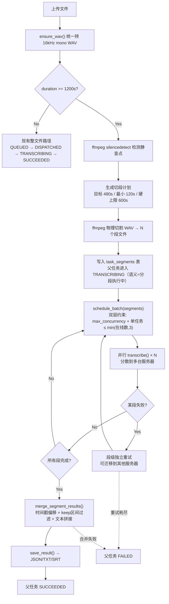

# VAD 分段并行转写方案（合并版）

> 本文档合并了两份独立研究方案的最优内容：
> - 方案 A：`超长音视频隐式分段并行方案（单任务外显）.md`
> - 方案 B：`.cursor/plans/vad_分段并行转写` 计划
>
> 差异点以「采纳来源」标注，共识部分直接合并。

---

## 一、目标与验收标准

- 超长文件（>=20 分钟）总完成时间显著下降，三台服务器集群下 wall-clock 至少下降 25%
- 最终文本不重复、不漏段，顺序稳定
- 时间戳单调递增，可导出可用的 JSON 和 SRT
- 用户侧仍然只看到一个任务（API/前端/回调不变）
- 短文件（<20 分钟）继续走现有整文件路径，零影响零时延增加

---

## 二、两方案差异对比与采纳决策

| 差异点 | 方案 A（研究员版） | 方案 B（架构版） | 采纳 | 理由 |
|--------|-------------------|-----------------|------|------|
| **触发阈值** | >=20 分钟（1200s） | >5 分钟（300s） | **A** | 20 分钟更保守，避免对中等时长文件的不必要切分 |
| **silencedetect 参数** | `-35dB:d=0.8` | `-50dB:d=0.5` | **A** | -35dB 更宽松，适合真实录音环境；0.8s 最小静音时长减少误切 |
| **段长参数** | 目标 480s，最小 120s，硬上限 600s | min=300s, max=900s | **A** | 段更短、更均匀，有利于跨服务器负载均衡 |
| **硬切兜底** | 有，600s 处硬切 + 400ms 重叠 | 无显式兜底 | **A** | 关键鲁棒性保障：某些音频可能长时间无静音 |
| **数据模型** | 独立 `task_segments` 表 | 复用 Task 表 + 3 字段 | **A** | 独立表更干净，不污染 Task 模型，段级字段更丰富（keep_start/end_ms） |
| **父任务状态机** | 不新增外部状态，语义聚合 | 新增 SEGMENTING/MERGING | **A** | 少改状态机 = 少改 API/前端/SSE/测试，侵入更小 |
| **调度约束** | 双层：max_concurrency + 单任务最多 min(在线数,3) 段并行 | 子任务自由参与 schedule_batch | **A** | 防止一个超长文件吃满集群、饿死短任务 |
| **overlap 管理** | 400ms + keep_start_ms/keep_end_ms 精确过滤 | 500ms + 末尾字符匹配去重 | **A** | keep_start/end 是更精确的机制，基于时间戳而非文本匹配 |
| **进度计算** | 按已完成有效音频时长 / 总时长 | 按段数 | **A** | 段长可能不均，按时长更准确 |
| **服务器元数据** | cpu_set/decoder_threads 写入 labels_json | 未涉及 | **A** | 与 CPU 绑核部署方案配合 |
| **架构细节** | 高层概述 | 具体函数签名、文件清单、状态图、Mermaid | **B** | 落地可执行性更强 |
| **实施步骤** | 未细化 | 8 步分解，每步独立验证 | **B** | 便于渐进实施 |
| **风险表** | 未单列 | 完整风险-缓解表 | **B** | 便于评审 |

---

## 三、合并后的架构设计

### 3.1 整体流程



### 3.2 数据模型：独立 task_segments 表

**采纳方案 A**：不在 Task 上加字段，新建独立表。父任务状态机不新增状态。

```
task_segments
├── segment_id          PK, ULID
├── task_id             FK → tasks.task_id
├── segment_index       SmallInteger, NOT NULL
├── source_start_ms     Integer, NOT NULL     -- 在原音频中的起始毫秒
├── source_end_ms       Integer, NOT NULL     -- 在原音频中的结束毫秒
├── keep_start_ms       Integer, NOT NULL     -- 去除 overlap 后的保留起始
├── keep_end_ms         Integer, NOT NULL     -- 去除 overlap 后的保留结束
├── storage_path        Text, NOT NULL        -- 段 WAV 文件路径
├── status              String(16)            -- PENDING/DISPATCHED/TRANSCRIBING/SUCCEEDED/FAILED
├── assigned_server_id  FK → server_instances.server_id, nullable
├── retry_count         SmallInteger, default 0
├── raw_result_json     Text, nullable        -- ASR 返回的原始 JSON
├── error_message       Text, nullable
├── created_at          DateTime
├── started_at          DateTime, nullable
├── completed_at        DateTime, nullable
```

**keep_start_ms / keep_end_ms 的含义**：

```
段 0: source=[0, 480400]    keep=[0, 480000]       ← 尾部 400ms 是 overlap
段 1: source=[479600, 960400] keep=[480000, 960000] ← 头尾各 400ms overlap
段 2: source=[959600, 1200000] keep=[960000, 1200000] ← 头部 400ms 是 overlap
```

合并时，每段只保留 `keep` 区间内的时间戳句子，自然去除重叠。

### 3.3 父任务状态语义（不新增状态）

**采纳方案 A**：复用现有状态，改变语义而非增加枚举。

| 父任务状态 | 含义（分段场景） | 触发条件 |
|-----------|----------------|---------|
| PREPROCESSING | 正在转码 + VAD 检测 + 切段 + 写入 segment 表 | 任务创建后 |
| QUEUED | 段清单已就绪，等待调度 | 切段完成 |
| TRANSCRIBING | 有段正在执行（聚合语义） | 第一个段开始执行 |
| SUCCEEDED | 所有段完成 + 合并成功 | 合并写入最终结果 |
| FAILED | 某段重试耗尽 或 合并失败 | 不可恢复错误 |

父任务 `progress` = 已完成段有效音频时长 / 总有效音频时长，映射到现有 `STATUS_PROGRESS_RANGES`。

### 3.4 调度约束：双层限制

**采纳方案 A**：防止一个超长文件饿死短任务。

```python
# 单个父任务的最大活跃段并行数
MAX_PARENT_ACTIVE_SEGMENTS = min(online_server_count, 3)
```

在 `_dispatch_queued_tasks()` 中：
1. 先查询每个分段父任务当前已有多少活跃段（DISPATCHED + TRANSCRIBING）
2. 只取出未达上限的父任务的待调度段
3. 这些段与普通短文件任务一起参与 `schedule_batch()`

### 3.5 VAD 切分参数

**采纳方案 A**：更适合真实录音环境。

| 参数 | 值 | 说明 |
|------|-----|------|
| `silencedetect noise` | -35dB | 宽松阈值，适配有底噪的录音 |
| `silencedetect duration` | 0.8s | 最小静音持续时间，减少字间误切 |
| 目标段长 | 480s (8 分钟) | 段长均匀，利于负载均衡 |
| 最小段长 | 120s (2 分钟) | 太短的段不值得独立调度 |
| 硬上限 | 600s (10 分钟) | 无静音点时强制切割 |
| 重叠 overlap | 400ms | 切点两侧各保留 400ms |
| 触发阈值 | 1200s (20 分钟) | 低于此走整文件路径 |

### 3.6 结果合并策略

合并规则（**综合两方案**）：

1. 按 `segment_index` 顺序处理各段的 `raw_result_json`
2. 对每段结果的 `stamp_sents`，过滤掉落在 `keep` 区间之外的句子（基于 `ts` 时间戳）
3. 保留句子的 `ts[0]` += `source_start_ms`，`ts[1]` += `source_start_ms`（回写到全局时间线）
4. 对 `timestamp` 字段同理偏移
5. 文本按顺序拼接
6. 若某段只有纯文本无可用时间戳，仍参与文本拼接，但标记 `internal_merge_status=TEXT_ONLY_FALLBACK`

### 3.7 服务器元数据扩展

**采纳方案 A**：CPU 绑核部署后需要记录配置。

在现有 `ServerInstance.labels_json` 中规范化以下键：

```json
{
  "cpu_set": "0-7",
  "decoder_threads": 2,
  "model_threads": 4,
  "io_threads": 4,
  "container_name": "funasr-cpu",
  "benchmark_profile": "cpu-8core-paraformer-large"
}
```

这些不参与调度计算（调度仍以 `max_concurrency + rtf_baseline` 为真值），仅用于运维诊断和文档化。CPU 绑核部署后通过 `POST /api/v1/servers/benchmark` 刷新 RTF 基线。

### 3.8 API 层适配

**综合两方案**：

- `GET /api/v1/tasks` 默认不返回子段信息
- `TaskResponse` 新增可选诊断字段（对现有消费者无影响）：
  - `internal_split_enabled: bool`
  - `internal_segments_total: int | null`
  - `internal_segments_completed: int | null`
  - `internal_assigned_server_ids: list[str] | null`
  - `internal_merge_status: str | null`
- 分段任务的 `assigned_server_id` 保持 `null`（多服务器参与，单字段无法表达）

---

## 四、需要改动的文件清单

| 文件 | 改动内容 | 复杂度 |
|------|---------|--------|
| `app/models/task_segment.py` | **新建**：TaskSegment ORM 模型 | 低 |
| `alembic/versions/` | 新增 migration：创建 task_segments 表 | 低 |
| `app/services/audio_preprocessor.py` | 新增 `silence_detect()` + `plan_segments()` + `split_wav_segments()` | 中 |
| `app/services/result_merger.py` | **新建**：多段结果合并（时间戳偏移 + keep 区间过滤 + 文本拼接） | 中 |
| `app/services/task_runner.py` | 预处理链检测长文件触发切段；段级调度逻辑；父任务监控与合并触发 | 高 |
| `app/services/scheduler.py` | `schedule_batch` 支持段级调度单元；双层并发约束 | 中 |
| `app/services/result_formatter.py` | `parse_timestamp_segments` 支持 offset 参数 | 低 |
| `app/schemas/task.py` | TaskResponse 增加可选诊断字段 | 低 |
| `app/api/tasks.py` | 分段诊断字段填充 | 低 |
| `app/storage/repository.py` | 新增 segment CRUD 方法 | 低 |

---

## 五、风险与缓解

| 风险 | 缓解措施 |
|------|---------|
| silencedetect 在噪声环境下切割不准 | 宽松参数 (-35dB, 0.8s) + 400ms overlap + 硬切兜底；后续可升级 FSMN-VAD |
| 某段转写失败导致整任务卡住 | 段级独立重试（可迁移服务器）；父任务设总超时兜底 |
| 重叠区域文本重复 | keep_start/end_ms 精确过滤，基于时间戳而非文本匹配 |
| 时间戳精度丢失 | WAV 按采样点精确切割，offset 按采样点数换算为毫秒 |
| 超长文件饿死短任务 | 双层调度约束，单父任务最多 min(在线数,3) 段并行 |
| 子任务数量膨胀 | 硬上限 600s + 最小段 120s；60 分钟最多 8-12 段 |
| 某段无时间戳数据 | TEXT_ONLY_FALLBACK 标记，文本仍正常拼接 |
| 段文件磁盘占用 | 合并成功后异步清理段文件；失败保留用于排障 |

---

## 六、实施顺序

分 8 步，每步可独立验证：

1. **数据模型**：新建 `TaskSegment` 模型 + Alembic migration
2. **VAD 切分**：`silence_detect()` + `plan_segments()` + `split_wav_segments()` + 单元测试
3. **结果合并**：`result_merger.py` + 单元测试（时间戳偏移、keep 过滤、TEXT_ONLY_FALLBACK）
4. **task_runner 切段**：预处理链检测长文件 → 切段 → 写入 segment 表
5. **task_runner 调度+监控**：段级调度 + 父任务完成检测 + 合并触发
6. **API 适配**：诊断字段填充 + 进度计算（按时长聚合）
7. **集成测试**：GuruMoringTeaching.mp3 (60min) 分段并行 vs 整文件基线
8. **E2E 对比基准**：wall-clock 下降比、文本质量、SRT 时间戳校验

---

## 七、假设与前提

- 部署环境已有可用 ffmpeg
- 大视频统一先抽音频到 canonical WAV，复用同一套切段流程
- 首版不引入 FSMN-VAD 模型，不把段暴露成用户可见任务
- 首版允许硬切兜底，通过 400ms overlap + keep 过滤降低边界风险
- 服务器 CPU 绑核后的容量变化通过 benchmark 刷新，调度器不直接解析 Docker 配置
