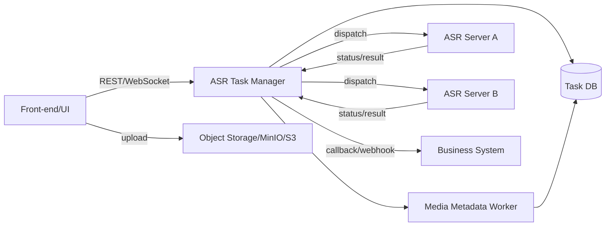
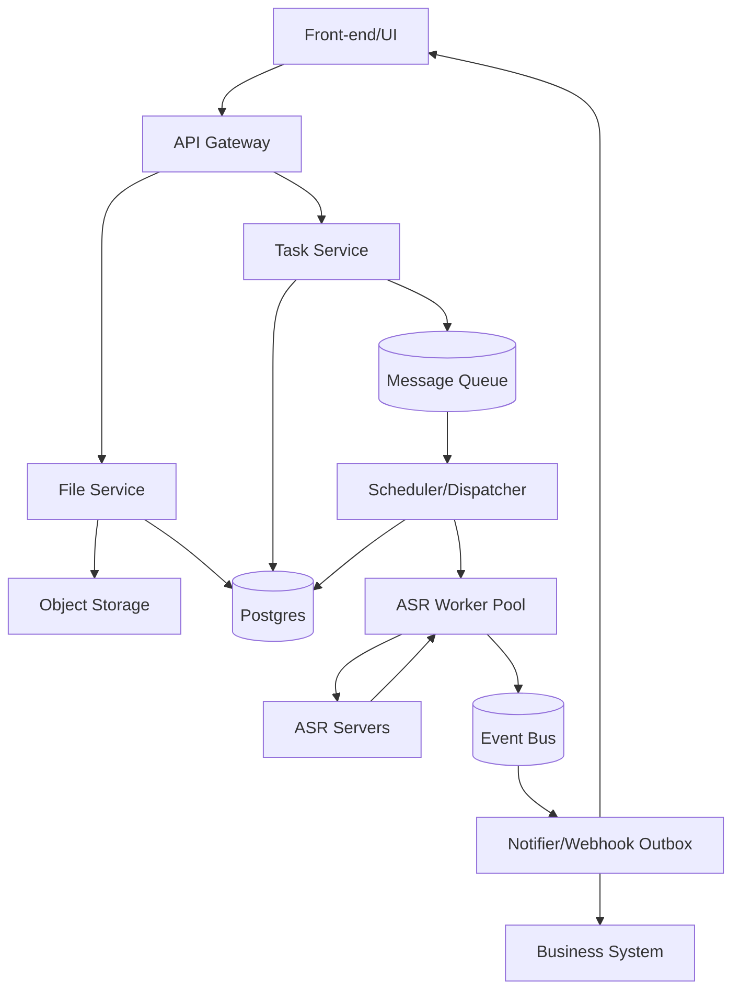
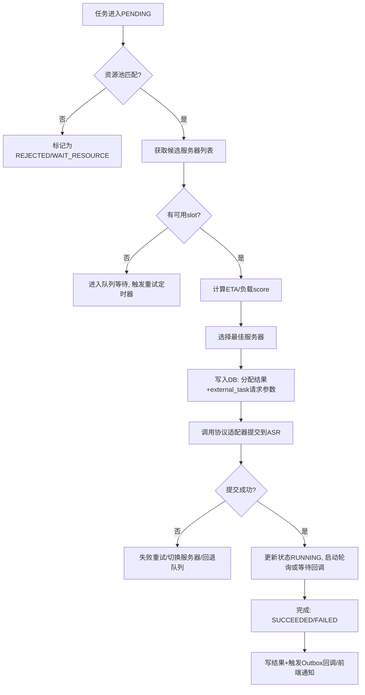

# 集中式离线ASR任务中转适配层（ASR任务管理器）设计与实现调研报告

## 执行摘要

本报告面向“集中式离线ASR任务中转适配层（ASR任务管理器）”的设计与落地实现，重点围绕并发上传/批量提交、统一编号与临时文件生命周期、任务数据库、ASR服务器资源监测、协议适配（新/旧接口）、动态分发与负载调度、进度与完成时间预估、任务状态回调与前端通知等核心能力，给出可选架构、调度策略与数据/接口设计建议。

结论上，若团队规模、预算、目标吞吐、是否有GPU资源均“未指定”，更稳健的路线是：以“集中式控制平面 + 事件/队列驱动的执行平面”的**渐进式架构**作为首选（先实现可用MVP，再平滑演进到更强的可扩展/多节点容错与K8s原生调度）。该路线能在工程复杂度与运维成本可控的前提下，提供可靠的异步任务语义（可重试、可恢复、可观测），并降低对下游ASR供应商/自建ASR服务接口差异的耦合。

设计的关键约束来自业界“异步离线识别”API的共性：**任务ID不一定适合作为业务唯一ID**，例如entity["organization","腾讯云","cloud platform"]在其语音识别接口文档中明确提示 TaskId **有效期为24小时**且“不同日期可能出现重复TaskId，请不要依赖TaskId作为业务系统里的唯一ID”；同时其状态码/状态字符串与结果字段也有固定契约。citeturn13view0 另一方面，entity["organization","阿里云","cloud platform"]的异步ASR接口通常返回 task_id 与 status，并提供“结果URL有效期（例如24小时）”等语义，意味着管理器必须具备结果拉取与自持久化能力，不能完全依赖短期URL。citeturn0search13turn0search14turn0search20

本报告明确**未纳入**的需求（需在产品层另行评估）：高优先级插队/抢占（含跨租户资源抢占策略）、转写后自动摘要/要点提取等二次处理链路（可在转写完成后作为下游任务扩展）。这些能力与核心“集中式离线ASR任务管理器”的最小闭环解耦，建议在MVP之后以“后处理任务链”方式扩展。

## 系统功能与需求分析

离线ASR任务管理器的定位是“统一入口 + 任务控制平面 + 协议适配 + 资源感知调度 + 状态/结果分发”。在不预设吞吐与硬件资源的情况下，功能需求应优先保证**正确性（幂等、可恢复、可追踪）**，再逐步优化性能与成本。

### 并发多用户上传与批量提交

并发上传与批量提交建议拆成两条链路：  
一条是“文件入库链路”（上传、校验、元信息抽取、落存），另一条是“任务创建链路”（选择模型/语言/选项、生成任务、入队等待调度）。这样做的工程收益是：当用户批量提交大量文件时，任务提交端不必同步做大量IO与媒体解析，系统更容易实现弹性与限流。

对于上传实现，建议使用“前端直传对象存储 + 服务端签名URL（或分片上传）”，管理器只持有元数据、校验结果与对象存储Key。该方式也更符合“集中式控制平面、分布式数据平面”的扩展模式。

### 文件元信息展示与统一编号

文件元信息至少包含：文件名、媒体类型（音频/视频与编码信息）、时长、大小、采样率/声道数等。时长与类型可由后台异步抽取：提交落存后触发“元信息抽取任务”，将结果写回文件表，前端轮询或订阅更新。

统一编号建议至少两级：
- `file_id`：文件级唯一标识（推荐ULID/UUIDv7，便于按时间排序与分库分表）。
- `task_id`：任务级唯一标识（同样建议ULID/UUIDv7），一个任务可关联一个或多个 file_id（批量任务可拆分为多个子任务，或用“任务组”概念）。

统一编号**不能依赖下游ASR的 taskId**。以entity["organization","腾讯云","cloud platform"]为例，其文档明确：TaskId 有效期仅24小时且可能跨日重复，不应作为业务系统唯一ID。citeturn13view0 因此管理器必须维护 `external_task_id`（下游任务ID）与 `task_id`（内部任务ID）的映射，并以内部ID为准。

### 转写进度展示、完成时间预估与回调到前端

离线转写的“真实进度”往往取决于下游ASR服务是否提供进度接口。若下游仅提供状态（waiting/doing/success/failed），管理器可以采用“两层进度”策略：
- **状态进度**：按阶段给出可解释的进度区间（如：上传完成 10%、入队 15%、调度成功 20%、ASR执行中 20%~95%、结果解析/入库 95%~100%）。
- **估算进度**：在ASR执行中，基于“文件时长 × 性能基线”估算完成时间，进度随时间推进并在状态回传后校正。

“性能基线”可用ASR业界常用的实时因子 RTF（Real-Time Factor）来描述：RTF 是处理时间与音频长度的比率。例如处理1分钟音频耗时30秒，RTF=0.5。citeturn7search0 管理器可维护“模型-硬件-并发数”的经验RTF，并用滑动窗口持续校准。

前端通知推荐两种并存：  
1）前端轮询（简单可靠，MVP优先）；2）WebSocket/SSE订阅（提升体验与减少无效请求）。当下游ASR完成后，管理器在内部任务状态变更为“SUCCEEDED/FAILED”时向前端推送事件，并提供结果下载/查看入口。

### 任务状态回调接口与完成回调

对外提供“状态回调接口”（Webhook）通常用于：第三方业务系统在任务结束时自动拉取结果或触发业务流程。这里需要注意**回调的可靠投递语义**：建议按“至少一次（at-least-once）”投递，并要求回调接收方以 `task_id + event_id` 做幂等去重。同时要引入“回调投递表/Outbox表”，避免“事务已提交但回调未发出”的一致性问题。

下游ASR侧也可能支持回调。例如entity["organization","腾讯云","cloud platform"]语音识别接口提供 CallbackUrl/回调机制，回调格式与签名策略应被管理器的“协议适配层”支持（统一转成内部事件）。citeturn0search25

### ASR服务器资源监测与容量建模

资源监测需覆盖：服务器数、每服务器线程/并发槽位、每线程计算能力、CPU/GPU利用率、显存、队列长度、吞吐（音频秒/秒）等。实现上，建议采用entity["organization","Prometheus","monitoring system"]体系：Node Exporter 采集主机硬件/内核指标，Prometheus拉取并存储指标，entity["organization","Grafana","observability dashboard"]展示与告警。citeturn7search7 对GPU侧，NVIDIA推荐用 DCGM Exporter 暴露GPU指标供Prometheus抓取。citeturn7search2turn7search22 entity["organization","华为云","cloud platform"]也给出了基于Prometheus+DCGM Exporter实现GPU观测与告警的最佳实践说明。citeturn7search14

### 协议适配（新版/旧版接口）与动态任务分发

协议适配层目标是“对内统一任务语义，对外兼容多种ASR接口”。不同ASR提供方的字段、状态码、结果结构差异显著：例如entity["organization","腾讯云","cloud platform"]的异步任务状态码是 0/1/2/3，状态字符串为 waiting/doing/success/failed，并且 Result 可能直接返回文本。citeturn13view0 entity["organization","阿里云","cloud platform"]的异步任务则通常通过 task_id + status 轮询，并可能给出 result_url 且“有效期24小时”。citeturn0search13turn0search14

因此调度/分发必须基于“适配后的统一状态机”与“资源模型”，而不是直接把下游字段暴露给前端/业务方。

### 未考虑功能声明

为避免范围蔓延（scope creep），本报告明确不覆盖：高优先级插队/抢占式调度、多租户严格公平份额（如DRF/层级队列抢占）、转写完成后的摘要/结构化信息抽取等能力。这些可作为后续迭代方向，在任务完成后以“二次处理工作流”方式扩展。

## 架构备选方案与对比

本节给出三种可落地架构，并比较可扩展性、容错性、实现复杂度、运维成本、延迟与吞吐。整体建议遵循“控制平面集中、数据平面解耦、执行平面可水平扩展”的最佳实践。

### 集中式调度器加工作节点

该方案把“任务管理、调度决策、协议适配、状态机与回调”集中在一个服务（或一组同构服务）中；工作节点可以是自建ASR服务器，也可以是“适配后的远端ASR服务”。适合MVP快速闭环，技术栈可保持单体或“轻量拆分”。



优点是路径短、调试简单、对外一致性强。缺点是调度器成为“控制平面热点”，需要做好水平扩展与一致性（例如用数据库行锁/乐观锁或分布式锁保护“同一任务只分发一次”）。

### 基于消息队列的微服务

该方案将“上传/文件服务、任务服务、调度服务、执行服务、通知服务”拆分，通过消息队列进行解耦。其核心价值是“天然异步 + 更强容错（重试/死信队列）+ 更容易水平扩展”。若未来吞吐不确定且需要多团队协作，此方案更利于演进。



业界任务队列系统如 Celery/RQ/Dramatiq 都可支撑该模式（见后文开源对比），其中 Celery 强调分布式任务与监控生态，RQ偏轻量、易入门。citeturn2view0turn19view0

### Kubernetes原生调度与批处理方案

当部署环境已经全面容器化且集群资源共享（多租户/多任务类型），可使用entity["organization","Kubernetes","container orchestration"]原生 Job/CronJob 表达“运行到完成”的离线转写任务，并结合K8s生态的队列与批调度（如Kueue/Volcano）实现配额与调度治理。Kubernetes Job 的定位就是“运行到完成（run to completion）”的工作负载。citeturn0search27 CronJob 用于定时触发批处理。citeturn0search29

在批调度层面，Kueue 是“作业级管理器”，决定作业何时被准入启动、何时停止/抢占。citeturn10search13turn10search37 Volcano 则是Kubernetes原生批调度系统，扩展 kube-scheduler 能力以更好支持AI/ML/HPC等批处理负载。citeturn9search0

```mermaid
flowchart LR
  FE[Front-end/UI] --> MGR[Task Manager (Control Plane)]
  MGR --> DB[(Task DB)]
  MGR --> CRD[Custom Resource / Job Spec]
  CRD --> K8S[Kubernetes API Server]
  K8S --> KUEUE[Kueue / Volcano]
  KUEUE --> JOB[Job Controller]
  JOB --> POD[ASR Pod(s)]
  POD --> OBJ[Object Storage]
  POD --> MGR
  MGR --> FE
```

该方案的优势是：天然的资源隔离、弹性与运维工具链；缺点是：学习与落地成本高（集群治理、镜像/节点/存储/网络、批调度器安装与升级），并且对“与多种外部ASR服务接口适配”仍需管理器承担。

### 方案对比与集中式离线转写最佳实践

| 维度 | 集中式调度器+工作节点 | 队列驱动微服务 | K8s原生批处理 |
|---|---|---|---|
| 可扩展性 | 中等：调度器需横向扩展 | 高：服务可分别扩展 | 很高：依赖集群与调度器能力 |
| 容错性 | 中等：需自建重试/恢复 | 高：队列与重试机制成熟 | 高：Pod重启/Job重试天然支持 |
| 实现复杂度 | 低~中 | 中~高 | 高 |
| 运维成本 | 低 | 中 | 高（尤其多租户/多队列治理） |
| 延迟 | 低（路径短） | 中（队列带来排队开销） | 中~高（调度与拉起Pod开销） |
| 吞吐 | 中~高（受调度器与ASR节点限制） | 高（水平扩展执行器） | 高（集群级扩展） |

对集中式离线转写系统，“最佳实践”通常包括：  
1）内部统一ID与状态机；避免依赖下游 taskId 的唯一性与生命周期（例如腾讯云 TaskId 有效期24小时且可能重复）。citeturn13view0  
2）控制平面与音频数据平面解耦（对象存储/统一Key）；因为下游结果URL可能有短期有效期（例如24小时），管理器需及时拉取并持久化结果或二次存储。citeturn0search13turn0search14  
3）调度必须资源感知（CPU/GPU/并发槽位），并以监控指标闭环校准（Prometheus + Node Exporter + DCGM Exporter）。citeturn7search7turn7search2  
4）回调投递采用Outbox与幂等，保证“状态变更—回调投递”的一致性与可恢复。

## 调度策略与资源模型

### 资源描述模型

建议把资源模型抽象成“可调度容量（Capacity）+ 可观测负载（Load）+ 性能基线（Baseline）”，以便同时支持CPU-only与GPU推理。

**服务器资源模型（ServerProfile）**（示例字段）：
- `server_id`：服务器唯一ID  
- `labels`：{model: sensevoice, lang: zh, vendor: tencent/asr-v1, gpu: true…}  
- `cpu_cores` / `memory_gb`  
- `gpu_count` / `gpu_mem_gb`（若有）  
- `worker_threads`：该服务器配置的并发线程/进程数（或“并发槽位”）  
- `rtf_baseline`：在“单并发”下的基线RTF（越小越快）。RTF定义可参考微软对实时因子的解释：RTF是处理时间与音频长度的比率。citeturn7search0  
- `throughput_baseline`：音频秒/秒（可由 1/RTF 推导）  
- `max_concurrency`：可接受的最大并发任务数（可能与线程、显存、上下文开销有关）

**运行负载模型（ServerLoad）**：
- `running_tasks`：当前执行中任务数  
- `queued_tasks`：已分配但尚未开始（或pull未取走）的任务数  
- `cpu_util`/`gpu_util` 等监控指标（来自Prometheus拉取的Exporter指标）。Node Exporter用于主机指标暴露。citeturn7search7 GPU侧可用DCGM Exporter暴露指标给Prometheus抓取。citeturn7search2turn7search22

### 任务队列模型

建议将任务排队抽象成三层：
- 全局队列：`global_pending`
- 资源池队列：按“模型/语言/供应商/硬件类型”划分，例如 `pool:sensevoice.zh.gpu`、`pool:vendor:tencent.v1.cpu`
- 租户/用户队列：用于未来做配额/限流/公平

K8s原生方案中，Kueue 的核心也在于“决定Job何时等待、何时准入启动、何时抢占/停止”，其文档明确了该“准入控制”定位。citeturn10search13 这类思想可直接迁移到自研调度器：先做准入，再做分配。

### 初期调度算法与伪代码

MVP阶段建议优先“可解释 + 易实现”的算法，并为将来升级留接口。可选策略：

- 顺序并发：按提交顺序取任务，分配到可用服务器（最简单、但不公平且可能低效）。
- 轮询（Round Robin）：在同一资源池内轮询服务器，避免单点热点。
- 最小负载优先（Least-Load）：选择 `effective_load` 最小的服务器，其中 `effective_load` 可综合 running_tasks、queued_tasks、CPU/GPU利用率等。
- 最短预计完成时间优先（Min-ETA）：基于文件时长与服务器RTF估算选择ETA最小者（更贴合“离线转写”目标）。

伪代码（Least-Load + Min-ETA 混合）：

```python
def pick_server(task, candidate_servers):
    # task.duration_sec 已从元信息抽取得到
    best = None
    best_score = float("inf")

    for s in candidate_servers:
        if s.available_slots <= 0:
            continue

        # 基线：单并发预计耗时 = duration * rtf_baseline
        base_time = task.duration_sec * s.rtf_baseline

        # 并发惩罚：并发越高，RTF可能变差；用简化的线性惩罚或经验曲线
        # penalty_factor 可按历史统计/在线拟合
        penalty = 1.0 + s.running_tasks * s.penalty_factor

        eta = base_time * penalty

        # 综合负载：可混入CPU/GPU利用率（需要监控体系）
        load_score = s.running_tasks + 0.5 * s.queued_tasks

        score = eta + load_score * task.load_weight
        if score < best_score:
            best_score = score
            best = s

    return best
```

RTF用于估算推理速度与延迟，RTF定义可参考微软对RTF的解释。citeturn7search0

### 调度流程图



上述“轮询或等待回调”需要适配不同供应商的语义：例如腾讯云提供 TaskStatus 的状态码/状态字符串与Result字段；citeturn13view0 阿里云异步ASR接口常见 task_id/status/result_url 且 result_url 可能24小时失效，需要尽快拉取并落库。citeturn0search13turn0search14

## 数据库与文件管理设计

本节给出任务表、文件表、服务器资源表等建议结构，并说明临时文件生命周期与统一编号策略。数据库以PostgreSQL为例（类型可按实际更换）。

### 数据库表结构建议

为减少表数量同时保留可扩展性，推荐“核心表 + 事件表（审计/状态历史）+ 指标快照表”。

#### files 表（文件与元信息）

| 字段 | 类型 | 约束 | 索引建议 | 说明 |
|---|---|---|---|---|
| file_id | CHAR(26) / UUID | PK | 主键 | ULID/UUIDv7 |
| user_id | BIGINT | NOT NULL | (user_id, created_at) | 归属用户/租户 |
| original_name | TEXT | NOT NULL |  | 原始文件名 |
| media_type | VARCHAR(32) |  | (media_type) | audio/video/unknown |
| mime | VARCHAR(128) |  |  | MIME |
| duration_sec | DOUBLE PRECISION |  |  | 时长（秒） |
| codec | VARCHAR(64) |  |  | 编码信息 |
| size_bytes | BIGINT | NOT NULL |  | 文件大小 |
| storage_backend | VARCHAR(16) | NOT NULL |  | local/nfs/s3 |
| storage_key | TEXT | NOT NULL | UNIQUE(storage_backend, storage_key) | 对象存储Key |
| checksum_sha256 | CHAR(64) |  | UNIQUE(checksum_sha256) 可选 | 去重/校验 |
| status | VARCHAR(16) | NOT NULL | (status, created_at) | UPLOADED/META_READY/DELETED |
| created_at | TIMESTAMP | NOT NULL |  |  |
| updated_at | TIMESTAMP | NOT NULL |  |  |

#### tasks 表（任务主表）

| 字段 | 类型 | 约束 | 索引建议 | 说明 |
|---|---|---|---|---|
| task_id | CHAR(26) / UUID | PK | 主键 | 内部唯一ID |
| user_id | BIGINT | NOT NULL | (user_id, created_at) |  |
| file_id | CHAR(26)/UUID | NOT NULL | (file_id) | 单文件任务；多文件可用中间表 task_files |
| task_group_id | CHAR(26)/UUID |  | (task_group_id) | 批量提交分组 |
| model_name | VARCHAR(64) | NOT NULL | (model_name, status) | 例如 sensevoice/whisper |
| language | VARCHAR(16) |  | (language, status) | zh/en/auto |
| priority | SMALLINT | DEFAULT 0 | (priority, created_at) | MVP可固定0（本报告不覆盖插队） |
| status | VARCHAR(16) | NOT NULL | (status, updated_at) | PENDING/RUNNING/SUCCEEDED/FAILED/CANCELED |
| progress | REAL | NOT NULL |  | 0~1（估算+校正） |
| eta_sec | INTEGER |  |  | 预计剩余秒数 |
| assigned_server_id | VARCHAR(64) |  | (assigned_server_id, status) | 调度结果 |
| external_vendor | VARCHAR(32) |  |  | tencent/aliyun/selfhost |
| external_task_id | TEXT |  | UNIQUE(external_vendor, external_task_id) 可选 | 下游任务ID（不可作业务唯一ID，尤其腾讯云TaskId可能重复）citeturn13view0 |
| result_location | TEXT |  |  | 结果存储位置（DB/S3 key） |
| error_code | VARCHAR(64) |  |  | 统一错误码 |
| error_message | TEXT |  |  | 失败详情 |
| created_at | TIMESTAMP | NOT NULL |  |  |
| updated_at | TIMESTAMP | NOT NULL |  |  |

#### task_events 表（状态历史/审计）

| 字段 | 类型 | 约束 | 索引建议 | 说明 |
|---|---|---|---|---|
| event_id | CHAR(26)/UUID | PK | 主键 | 幂等去重关键 |
| task_id | CHAR(26)/UUID | NOT NULL | (task_id, created_at) |  |
| from_status | VARCHAR(16) |  |  |  |
| to_status | VARCHAR(16) | NOT NULL |  |  |
| payload_json | JSONB |  | GIN(payload_json) 可选 | 下游原始回包/适配后结构 |
| created_at | TIMESTAMP | NOT NULL |  |  |

#### server_instances / server_metrics 表（资源与监测）

| 表 | 字段示例 | 索引建议 | 说明 |
|---|---|---|---|
| server_instances | server_id(PK), endpoint, labels(JSONB), max_concurrency, rtf_baseline, status | (status), GIN(labels) | 注册与配置 |
| server_metrics | server_id, ts, cpu_util, gpu_util, running_tasks, queued_tasks, throughput | (server_id, ts DESC) | 定期快照（也可直接依赖Prometheus，不落DB） |

### 临时文件生命周期与存储方案

临时文件管理的目标是：降低本地磁盘压力、避免重复拷贝、保证可追溯与可清理。建议生命周期如下：
1）上传期：文件落对象存储（或NFS）后标记为 `UPLOADED`；  
2）解析期：元信息抽取成功后标记为 `META_READY`；  
3）执行期：ASR Worker 从对象存储拉取（或按需转码后产生临时中间文件）；  
4）清理期：任务完成后，按策略清理中间文件，仅保留原始文件与结果（或按合规要求删除原始音频）。

需要特别注意：若下游ASR仅返回短期 result_url（如阿里云示例的24小时有效期），管理器侧应尽快拉取并转存，以免过期。citeturn0search13turn0search14

统一编号策略上，建议对象存储Key采用分层前缀，便于生命周期规则与批量清理，例如：  
`{tenant}/{yyyy}/{mm}/{file_id}/original`、`{tenant}/{yyyy}/{mm}/{task_id}/result.json`。

## 接口与协议适配

本节定义“前端↔管理器”和“管理器↔ASR服务器”的接口示例，并讨论新旧协议适配策略、回调机制与错误处理。

### 前端与管理器接口示例（REST）

核心原则：所有接口以内部 `task_id/file_id` 为主键；对外屏蔽下游差异；返回的 status/progress/eta 是“内部统一语义”。

**创建上传URL**  
`POST /v1/files/upload-url`

请求：
```json
{
  "filename": "a.mp4",
  "size_bytes": 12345678,
  "content_type": "video/mp4",
  "sha256": "..."
}
```

响应：
```json
{
  "file_id": "01J...ULID",
  "upload_url": "https://...signed...",
  "expires_in_sec": 900
}
```

**提交转写任务（可批量）**  
`POST /v1/tasks`

请求：
```json
{
  "items": [
    {
      "file_id": "01J...A",
      "model_name": "sensevoice",
      "language": "zh",
      "options": {"diarization": false}
    }
  ],
  "client_callback": {
    "url": "https://client.example.com/asr/callback",
    "secret_id": "callback-key-1"
  }
}
```

响应：
```json
{
  "task_group_id": "01J...G",
  "tasks": [
    {"task_id": "01J...T1", "status": "PENDING"}
  ]
}
```

**查询任务状态**  
`GET /v1/tasks/{task_id}`

响应（统一视图）：
```json
{
  "task_id": "01J...T1",
  "status": "RUNNING",
  "progress": 0.43,
  "eta_sec": 320,
  "file": {"file_id": "01J...A", "duration_sec": 1800.5},
  "result": null,
  "error": null
}
```

### 状态回调机制（Webhook）

回调建议采用“事件驱动 + Outbox + 重试”。回调体示例：

```json
{
  "event_id": "01J...E",
  "task_id": "01J...T1",
  "status": "SUCCEEDED",
  "progress": 1.0,
  "result_ref": {"type": "s3", "key": "tenant/2026/02/01J...T1/result.json"},
  "ts": "2026-02-26T12:34:56Z",
  "signature": "HMAC-SHA256(...)"
}
```

接收方必须以 `event_id` 幂等处理，管理器侧则保证失败可重试、可追踪（Outbox表记录投递次数与最后错误）。

### 管理器与ASR服务器接口（REST/gRPC）

为了适配自建ASR服务与第三方ASR服务，建议在内部抽象出统一的“Adapter接口”：

- `submit(task) -> external_task_id`
- `query(external_task_id) -> status/progress/result_ref`
- `cancel(external_task_id)`
- `normalize(raw_response) -> canonical_event`

下游协议可选择REST或gRPC；若使用推理服务框架，可借鉴entity["company","NVIDIA","gpu company"]的 Triton Inference Server：它支持 HTTP/REST 与 gRPC 并基于KServe社区推理协议，同时提供健康检查、元数据与统计等端点能力，这类能力对“资源监控 + 调度决策”很有价值。citeturn28search2turn28search5turn28search12 其官方文档亦说明了HTTP/REST与gRPC协议及扩展。citeturn28search0

### 新版/旧版协议适配策略

建议采用“内部规范模型（Canonical Model）+ 多适配器（Adapters）+ 版本探测/配置驱动（Config-driven）”：
- **Canonical Model**：内部统一任务状态（PENDING/RUNNING/SUCCEEDED/FAILED/CANCELED）、统一错误码、统一result_ref。
- **Adapter**：每个下游实现一个适配器，做字段映射、状态码映射、重试策略、限流策略。
- **版本探测**：优先通过“服务注册表”配置该ASR节点支持的协议版本/能力（是否有回调、是否有进度、是否返回result_url等），调度器据此选择策略。

映射示例：腾讯云的 0/1/2/3 与 waiting/doing/success/failed 可映射到内部 PENDING/RUNNING/SUCCEEDED/FAILED。citeturn13view0 阿里云异步ASR的 task_id/status/result_url 则在内部保持 `external_task_id` 与 `result_ref`，并补充“结果URL过期后自动转存”的规则。citeturn0search13turn0search14

## 开源参考与可复用项目

以下从entity["company","GitHub","code hosting platform"]检索并选取“任务队列/工作流/批调度/分布式执行/ASR工具”相关项目（≥10个），给出简介、关键能力、语言/技术栈、许可、活跃度（最近提交时间）、可借鉴点与局限。最近提交时间以各仓库 commit 列表页面显示日期为准。

| 项目 | GitHub链接 | 类型 | 关键能力摘要 | 语言/栈 | 许可 | 最近提交时间 | 可借鉴点（对ASR任务管理器） | 局限 |
|---|---|---|---|---|---|---|---|---|
| Celery | https://github.com/celery/celery | 任务队列 | 分布式任务队列、worker并发、路由、重试与监控生态；强调实时任务也支持调度 | Python | BSD-3-Clause（代码）；文档另含CC协议 | 2026-02-23 citeturn5view0 | 适合作为“队列驱动执行平面”；生态成熟（Flower/监控等） | 依赖消息中间件；对于“资源感知调度”需自定义扩展 citeturn2view0turn29view0 |
| RQ (Redis Queue) | https://github.com/rq/rq | 任务队列 | 基于Redis的轻量任务队列；支持优先队列与调度/cron扩展 | Python + Redis | BSD-2-Clause | 2026-02-22 citeturn23view0 | MVP友好，易做“任务入队→worker执行→状态回写” | 原生对复杂工作流/资源模型较弱；需要额外机制做可靠回调与指标闭环 citeturn19view0turn22search10 |
| Dramatiq | https://github.com/Bogdanp/dramatiq | 任务队列 | Python后台任务处理库，提供broker与worker模型 | Python | LGPL（备注COPYING/LESSER） | 2026-02-07 citeturn24view1 | 代码结构清晰，可借鉴worker中间件/结果后端等实现 | LGPL在部分企业合规场景下可能受限；生态不如Celery大 citeturn18search1 |
| Prefect | https://github.com/PrefectHQ/prefect | 工作流编排 | Pythonic工作流/任务编排，强调动态工作流、重试、可观测与编排能力 | Python | Apache-2.0 | 2026-02-26 citeturn6view0 | 若ASR流程会演进成“转写→对齐→质检→归档”的链式工作流，可借鉴其任务编排理念 | 面向数据工作流场景，直接用于“高吞吐ASR调度”可能偏重 citeturn1search5turn6view0 |
| Apache Airflow | https://github.com/apache/airflow | 工作流调度 | DAG工作流编排、定时与依赖管理、任务监控 | Python | Apache-2.0 | 2026-02-26 citeturn6view1 | 适合“离线批处理流水线”与周期任务（清理/归档/报表） | 对“海量短任务 + 低延迟调度”不一定最优；部署与维护偏重 citeturn4view2turn29view1 |
| Argo Workflows | https://github.com/argoproj/argo-workflows | K8s工作流 | K8s工作流引擎；以CRD表达工作流并提供API/SDK | Go + K8s | Apache-2.0 | 2026-02-25 citeturn6view2 | 若目标环境是K8s，可借鉴其“声明式工作流+可观测”与多步骤任务编排 | 引入K8s复杂度；对“协议适配/外部ASR”仍需自研管理器逻辑 citeturn2view3turn29view2 |
| Kueue | https://github.com/kubernetes-sigs/kueue | K8s作业队列/配额 | 决定Job何时等待、何时准入启动、何时抢占/停止；强调配额与公平共享 | Go + K8s | Apache-2.0 | 2026-02-26 citeturn26view0 | 可直接借鉴其“准入控制/配额治理”思想用于多租户ASR集群 | 依赖K8s生态；若系统不在K8s上运行，需移植思想而非直接使用 citeturn10search13turn10search21 |
| Volcano | https://github.com/volcano-sh/volcano | K8s批调度 | Kubernetes原生批调度系统，增强kube-scheduler以支持批处理/AI/HPC负载 | Go + K8s | Apache-2.0 | 2026-02-10 citeturn27view1 | 对大量离线ASR批任务（尤其GPU）可提供更强队列/调度能力 | 引入集群治理复杂度；对ASR协议适配仍需上层系统 citeturn9search0turn9search12 |
| Ray | https://github.com/ray-project/ray | 分布式计算 | 统一框架扩展Python/AI工作负载；包含分布式运行时与AI库 | Python/C++ | Apache-2.0 | 2026-02-25 citeturn10search6 | 可作为“动态任务分发与弹性扩容”的执行层（尤其多GPU/多节点） | 引入新的分布式运行时与运维复杂度；与现有ASR服务需做集成层 citeturn9search10turn9search2 |
| Triton Inference Server | https://github.com/triton-inference-server/server | 推理服务 | 统一推理Serving，支持HTTP/REST与gRPC，基于KServe推理协议，提供健康检查/统计/模型管理等端点 | C++/Python | BSD类许可（见LICENSE说明） | 2026-01-28 citeturn27view0 | 若ASR模型自部署，可借鉴其“标准化协议+统计端点”用于资源监控与调度 | 侧重推理Serving而非任务编排；离线批任务仍需上层管理器 citeturn28search2turn9search3 |
| OpenAI Whisper | https://github.com/openai/whisper | ASR模型/工具 | 通用语音识别模型与推理代码 | Python | MIT | 2025-06-26 citeturn15view0 | 可作为自建ASR的参考实现（模型推理、语言识别等） | “任务管理/调度/多租户”并非其关注点；生产化需补齐服务化与监控 citeturn14search4turn14search0 |
| FunASR | https://github.com/modelscope/FunASR | ASR工具箱 | ASR/VAD/标点/说话人相关能力与预训练模型生态 | Python/C++ | MIT（代码）；模型另有协议 | 2025-12-29 citeturn16view0 | 对中文ASR与工业落地较友好，可借鉴其推理/部署脚本与模型生态 | 同样不提供“集中式任务管理器”；模型许可与第三方组件需合规评估 citeturn14search5turn17search0 |
| WeNet | https://github.com/wenet-e2e/wenet | ASR工具箱 | 强调Production-ready的端到端语音识别工具栈 | Python/C++ | Apache-2.0 | 2025-12-19 citeturn16view3 | 可借鉴其“生产优先”理念、模型/工具链与中文场景实践 | 需要自建服务化、调度与数据通路；与现有系统集成成本需评估 citeturn14search6turn14search2 |
| Kaldi | https://github.com/kaldi-asr/kaldi | ASR工具箱 | 经典ASR工具箱与大量训练/解码配方 | C++/Shell | Apache-2.0（项目内多处声明） | 2024-11-26 citeturn14search3 | 适合理解ASR传统组件与性能调优方法 | 工程栈较旧、学习成本高；更适合作为研究/基础能力参考 citeturn14search7turn14search11 |

> 备注：上述“是否活跃”以最近提交时间作为直观指标；从项目现状看，Kueue/RQ/Celery/Dagster等在2026年2月仍有频繁提交，活跃度高；Whisper本体提交相对较少但可能处于相对稳定阶段。citeturn26view0turn23view0turn5view0turn15view0

## 技术栈、运维安全与最终推荐

### 技术栈建议（Python优先）

在Python优先的前提下，推荐“API层 + 队列/执行层 + 数据层 + 存储层 + 可观测性”的组合，并为未来K8s化预留接口。

- API与管理器：FastAPI（或Flask）+ Pydantic（配置/校验）  
- 任务队列：Celery（更成熟的分布式能力）或RQ（更轻量的MVP）；两者均有成熟生态与活跃社区。citeturn2view0turn19view0  
- 数据库：PostgreSQL（强一致事务、JSONB、索引能力）  
- 缓存/锁：Redis（任务队列/限流/分布式锁可选）  
- 存储：MinIO/S3（对象存储），本地/NFS仅作为小规模或过渡  
- 协议：对内可用gRPC（高吞吐），对外REST（兼容与易调试）；若自建推理服务，Triton的HTTP/REST+gRPC协议与统计端点可作为参考。citeturn28search0turn28search2  
- 监控：Prometheus + Grafana；主机指标用Node Exporter，GPU指标用DCGM Exporter。citeturn7search7turn7search2turn7search22

### 安全、监控与运维要点

认证鉴权方面，建议至少实现：API Token/签名鉴权（内部用户或系统间调用）、回调签名校验（HMAC）、以及细粒度权限（用户只能访问自身任务与文件）。配额与限流建议以“上传带宽”“并发任务数”“日/小时任务量”三类维度实现，并把策略放在网关层或管理器中间件层。

监控方面，推荐把“调度质量指标”作为一等公民：队列长度、P95等待时间、P95执行时长、失败率、重试次数、各服务器吞吐与RTF漂移等。RTF作为速度度量在ASR中常用，定义可参考微软文档：RTF是处理时间与音频长度比率。citeturn7search0

升级与故障恢复方面，重点是：
- 任务状态机可恢复：任何时刻宕机重启后，系统能依据DB中“分配记录 + 心跳/租约”判断任务是否需要重试或重新分配。
- 外部回调可重放：Outbox记录使得回调失败可重试、系统重启后可继续投递。
- 结果可追溯：对于下游result_url短期有效（如24小时）场景，必须“尽快拉取→落库存储”，防止过期导致结果丢失。citeturn0search13turn0search14

### MVP实现路线图与工时估算

在团队规模未指定的情况下，以“1~2名后端 + 0.5名前端/测试（折算）”的常见配置粗略估算，建议按“可闭环优先”划分里程碑（人周为粗略量级）：

- 里程碑A：任务最小闭环（约2~3人周）  
  交付物：任务API（创建/查询）、文件入库（对象存储）、files/tasks表、基础状态机（PENDING→RUNNING→SUCCEEDED/FAILED）、前端轮询展示。
- 里程碑B：协议适配与结果落库（约2~4人周）  
  交付物：至少接入1种下游ASR（新接口或旧接口），实现 external_task_id 映射、轮询/回调、结果解析与存储；明确“下游TaskId不可做业务唯一ID”的处理。citeturn13view0
- 里程碑C：资源监控与初版调度（约2~4人周）  
  交付物：服务器注册表、最小负载优先调度、ETA估算（基于RTF）、Prometheus指标接入（Node Exporter/可选DCGM）。citeturn7search7turn7search2
- 里程碑D：可靠回调与运维化（约2~3人周）  
  交付物：Outbox回调、幂等事件、告警面板、故障恢复流程（卡死任务回收、重试策略）。

### 最终推荐与下一步行动清单

综合可行性、开发成本与扩展性，推荐采用“**集中式任务管理器（控制平面）+ 队列驱动的执行器（执行平面）**”作为默认落地方案：MVP阶段可单体实现（API+调度+适配+回调在一个服务内），但内部模块化并明确“队列/事件边界”，便于后续拆成微服务；当任务量与多租户治理需求上升时，再迁移/融合到K8s批调度（Kueue/Volcano）体系。该推荐与云厂商异步ASR普遍提供的“task_id+status/回调+短期结果URL”契约相容，并能规避“外部TaskId不可作为唯一ID”的风险点。citeturn13view0turn0search13turn10search13turn9search0

下一步行动清单（面向落地）：
- 明确内部统一状态机与 ID 规范（task_id/file_id），并固化 external_task_id 映射策略（尤其针对TaskId可能重复的下游）。citeturn13view0  
- 选定MVP接入的下游ASR协议（新/旧之一），完成最小适配器与结果落库（避免result_url过期）。citeturn0search13turn0search14  
- 建立资源监控闭环：至少Node Exporter→Prometheus→Grafana；若有GPU则引入DCGM Exporter。citeturn7search7turn7search2turn7search14  
- 落地初版调度（Least-Load/Min-ETA），并以RTF基线持续校准完成时间预估。citeturn7search0  
- 设计并实现Outbox回调与幂等事件，保证对外回调可恢复、可追踪。