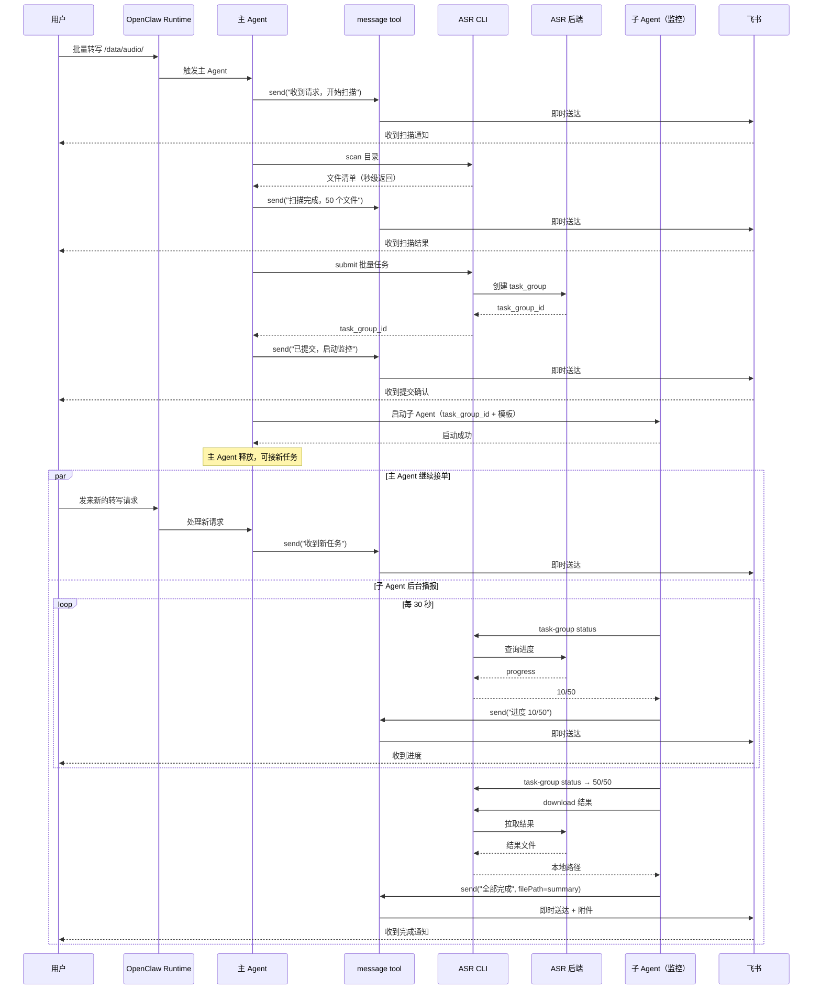

# 主 Agent 异步调度与子 Agent 监控播报架构设计

> 日期：2026-05-06
> 状态：方案讨论
> 优先级：P0（核心架构决策）
> 前置文档：`Agent实时通知原语设计方案-20260505.md`、`CHANNEL-NOTIFICATION.md`

---

## 1. 背景与问题

### 1.1 讨论起点：CLI 为什么不能直接用 OpenClaw 的飞书 Channel？

在 OpenClaw 环境中，飞书的 App 凭据、Chat ID、用户 OU、Group OU 全部已经配置完毕。用户非常反感在这套已配好的体系之外，又让 CLI 自建一套发送通道。

然而现实是：**CLI 作为 Python 子进程，无法调用 OpenClaw 的 `message` tool。**

`message` tool 是 OpenClaw 平台内部的工具调用协议，它存在于 Agent 与 OpenClaw runtime 之间的对话上下文中，以 JSON 格式交互。CLI 跑在 Agent 的 shell 环境里，但与 OpenClaw 的工具系统没有连接通道。

**类比**：`message` tool 是公司内部邮件系统，只有在职员工（Agent）能用员工证登录。CLI 是外包团队，虽然在同一栋楼办公，但没有员工证，只能自己去邮局（直接调飞书 API）寄信。

### 1.2 现状：主 Agent 被长任务卡死

```
用户发起批量转写 50 个文件
→ 主 Agent 调用一条长阻塞 CLI 命令
→ CLI 内部：上传全部 → 创建任务组 → while 轮询直到全部完成 → 下载结果
→ 8 分钟后 CLI 才返回
→ 这 8 分钟里，Agent 拿不回控制权，无法：
  - 调用 message tool 发进度通知
  - 响应新用户的消息
  - 承接新的转写任务
```

单文件之所以"看起来基本实时"，不是因为它更先进，而是因为单文件链路天然被拆成很多短调用，控制权频繁回到 Agent 手中，所以能在每步之间插入 `message` tool。

### 1.3 Skill 能解决多少？

Skill 可以（也应该）定义清晰的链路和通知点：

```
Phase 1 → send_user_notice → Phase 2 → send_user_notice → ...
```

但 Skill 本质是 prompt 约束，它能提高遵循率，不能提供硬保证。更关键的是：**如果 CLI 是一个 8 分钟不返回的黑盒，Skill 再严格也没法在黑盒内部插消息。**

所以结论是：**Skill 负责定义链路，但链路要能执行，前提是每个阶段之间控制权必须回到大模型。**

---

## 2. 方案比选

### 2.1 四种候选方案

| # | 方案 | 核心思路 | 确定性 | 复杂度 | 可移植性 |
|---|------|---------|--------|--------|---------|
| A | OpenClaw 暴露本地 HTTP 端点 | CLI 通过 `localhost:9091/message` 调用 OpenClaw 通道 | 高 | 需 OpenClaw 改造 | 仅 OpenClaw |
| B | CLI 内建 `--notify` 直接调飞书 API | CLI 自己持有凭据发送 | 高 | 中 | 跨平台 |
| C | 拆 CLI 为短命令 + Skill 编排 | `scan → notify → submit → notify → poll → notify` | 中高 | CLI 需拆分 | 跨平台 |
| **D** | **主 Agent 调度 + 子 Agent 监控播报** | 主 Agent 发起任务立即释放，子 Agent 专职盯进度、发通知 | **中高** | **利用现有能力** | **跨平台** |

### 2.2 为什么选方案 D

方案 A 需要 OpenClaw 团队配合改造 runtime，我们无法控制时间线。

方案 B 已经实现（`cli notify send`），但用户明确表达了反感：在已配置好的 OpenClaw 飞书通道之外又要配一套凭据。这在当前服务器上能跑，但迁移到其他服务器时，不管是读取别人的 ENV 还是让用户输入这些信息都很敏感。

方案 C 需要把 CLI 的批量命令全部拆成短步骤，改动面大，且仍然把主 Agent 绑在轮询循环里。

**方案 D 的核心优势**：

1. **不需要 CLI 发送通知**——通知完全由子 Agent 通过 `message` tool 发出，复用 OpenClaw 已配好的飞书 Channel。
2. **主 Agent 不被卡死**——发起任务后立即释放，可以继续在群聊中与多个用户沟通、承接新任务。
3. **用户体感最好**——一边有子 Agent 持续播报进度，一边机器人还能响应新请求。
4. **不依赖外部改造**——纯粹靠 Agent 调度能力实现，不需要 OpenClaw 改 runtime。

### 2.3 方案 D 的已知局限

| 局限 | 影响 | 缓解措施 |
|------|------|---------|
| 子 Agent 是大模型，不是精确定时器 | 轮询间隔可能有偏差 | Skill 约束固定模板、固定查询命令，最小化自由发挥空间 |
| 子 Agent 可能崩溃或中断 | 进度播报断裂 | 主 Agent 在 final summary 中兜底检查，补发完成通知 |
| 通知可能重复或乱序 | 用户收到重复消息 | 通知内容自带 seq/Phase 标识，子 Agent 维护已发送 seq |
| 子 Agent 占用额外 token | 成本增加 | 子 Agent 功能极简——只查状态+套模板+调 message tool |
| 主 Agent abort 后子 Agent 可能继续播报 | 用户困惑 | 子 Agent 检测到任务终态后自动退出 |

---

## 3. 目标架构

### 3.1 核心理念

```
主 Agent = 接单员 + 调度员（轻量、快速释放）
子 Agent = 专职监控播报员（绑定单个任务/任务组，持续跟踪并通知）
CLI/后端 = 纯粹的执行引擎（不管通知，只管干活）
```

### 3.2 时序图

```
┌───────────────────────────────────────────────────────────────────────────────┐
│                         目标架构：异步调度 + 子 Agent 播报                      │
│                                                                               │
│  用户A: "批量转写 /data/audio/"                                               │
│    │                                                                          │
│    ▼                                                                          │
│  主 Agent                                                                     │
│    │                                                                          │
│    ├─① message tool: "收到批量转写请求，开始扫描目录..."                        │
│    │                                                                          │
│    ├─② CLI: scan 目录 → 返回文件清单（秒级）                                  │
│    │                                                                          │
│    ├─③ message tool: "扫描完成，发现 50 个文件，正在提交..."                    │
│    │                                                                          │
│    ├─④ CLI: submit 批量任务 → 返回 task_group_id（秒级）                      │
│    │                                                                          │
│    ├─⑤ message tool: "已提交任务组 TG-xxx，启动进度监控..."                    │
│    │                                                                          │
│    ├─⑥ 启动子 Agent（绑定 task_group_id + 通知模板）                          │
│    │                                                                          │
│    └─⑦ 主 Agent 释放 ← 可以继续接新任务                                      │
│                                                                               │
│  ────────────────────────────────────────────────────────────────              │
│                                                                               │
│  子 Agent（监控播报）                用户 B: "帮我转写这个文件"                │
│    │                                    │                                     │
│    ├─ CLI: task-group status TG-xxx     ▼                                     │
│    │   → 10/50 完成                  主 Agent                                 │
│    ├─ message tool: "进度 10/50"       ├─ message tool: "收到文件"             │
│    │                                   ├─ 开始处理用户 B 的请求               │
│    ├─ 等待 30 秒                       └─ ...                                 │
│    │                                                                          │
│    ├─ CLI: task-group status TG-xxx                                           │
│    │   → 35/50 完成                                                           │
│    ├─ message tool: "进度 35/50"                                              │
│    │                                                                          │
│    ├─ 等待 30 秒                                                              │
│    │                                                                          │
│    ├─ CLI: task-group status TG-xxx                                           │
│    │   → 50/50 完成                                                           │
│    ├─ CLI: download 结果                                                      │
│    ├─ message tool: "全部完成！50/50 成功，结果已归档。"                        │
│    └─ 子 Agent 退出                                                           │
│                                                                               │
└───────────────────────────────────────────────────────────────────────────────┘
```

### 3.3 Mermaid 时序图



---

## 4. 详细设计

### 4.1 主 Agent 职责

主 Agent 是接单员和调度员，职责明确且轻量：

| 阶段 | 操作 | 耗时 | 说明 |
|------|------|------|------|
| 受理 | 解析用户意图 | <1s | 判断是批量转写/单文件/其他 |
| 通知 | `message tool`: 已收到 | <1s | 用户立即得到响应 |
| 扫描 | `CLI: scan` | 1-5s | 短命令，立即返回 |
| 通知 | `message tool`: 扫描结果 | <1s | |
| 提交 | `CLI: submit` | 2-10s | 短命令，返回 task_group_id |
| 通知 | `message tool`: 已提交 | <1s | |
| 委托 | 启动子 Agent | <2s | 传递 task_group_id 和监控模板 |
| 释放 | 可接新任务 | — | 总耗时 <20s |

**关键约束**：主 Agent 在提交任务后**不进入轮询循环**，而是立即启动子 Agent 并释放自己。

### 4.2 子 Agent 职责

子 Agent 是专职监控播报员，**绑定一个 `task_group_id`**，功能极简：

```
子 Agent 生命周期:

1. 接收参数: task_group_id, 通知模板, 轮询间隔
2. 循环:
   a. CLI: task-group status {task_group_id} --format json
   b. 解析: succeeded/failed/running/total
   c. 判断: 是否有新进展（与上次比较）
   d. 如果有新进展 → message tool: 按模板发送进度
   e. 如果全部完成 → 进入结果处理
   f. 等待 30 秒
3. 结果处理:
   a. CLI: download 结果到本地
   b. message tool: 发送完成汇总 + 结果文件
4. 退出
```

**子 Agent 不做的事**：
- 不做意图理解
- 不做自由文本生成（只套模板）
- 不做任务编排
- 不响应用户对话

### 4.3 CLI 命令适配

当前批量 CLI 是一条长阻塞命令，需要拆分以支持新架构。以下是 CLI 需要暴露的短命令接口：

| 命令 | 用途 | 返回 | 调用方 |
|------|------|------|--------|
| `task-group scan` | 扫描目录，生成 manifest | JSON: 文件列表、数量、总时长 | 主 Agent |
| `task-group submit` | 提交 manifest 到后端 | JSON: task_group_id, task_count | 主 Agent |
| `task-group status` | 查询任务组状态 | JSON: succeeded/failed/running/total | 子 Agent |
| `task-group download` | 下载已完成任务的结果 | JSON: 下载路径、成功/失败数 | 子 Agent |

每条命令都是**秒级返回**，不做内部循环轮询。

#### 4.3.1 `task-group status` 输出格式

```json
{
  "task_group_id": "TG-20260506-001",
  "status": "RUNNING",
  "total": 50,
  "succeeded": 35,
  "failed": 2,
  "running": 8,
  "pending": 5,
  "elapsed_seconds": 312,
  "estimated_remaining_seconds": 180,
  "last_completed": {
    "task_id": "T-0042",
    "filename": "meeting-2026-05-01.mp4",
    "duration_seconds": 1820,
    "result_chars": 4521
  }
}
```

子 Agent 只需读这个 JSON，套模板，调 `message tool`。

### 4.4 通知模板

子 Agent 发送的通知必须来自固定模板，不允许自由发挥：

**进度通知模板**：

```
📊 批量转写进度

✅ 已完成: {succeeded}/{total}
❌ 失败: {failed}
⏳ 处理中: {running}
⏱️ 已耗时: {elapsed}
🕐 预计剩余: {estimated_remaining}
```

**完成通知模板**：

```
🎉 批量转写全部完成

📁 任务组: {task_group_id}
📊 结果: {succeeded} 成功 / {failed} 失败 / {total} 总计
⏱️ 总耗时: {elapsed}
📂 结果目录: {result_dir}

{如有失败项，列出失败文件名和原因}
```

**异常通知模板**：

```
⚠️ 批量转写异常

任务组: {task_group_id}
异常类型: {error_type}
详情: {error_message}
建议: {suggestion}
```

### 4.5 子 Agent 的 Skill 规程草案

```
子 Agent Skill 核心逻辑（伪代码）:

参数:
  task_group_id: string      # 由主 Agent 传入
  poll_interval: 30          # 秒
  notify_template: "batch"   # 使用批量转写模板

执行:
  last_succeeded = 0
  last_failed = 0

  while true:
    # Step 1: 查询状态
    result = CLI: task-group status {task_group_id} --format json

    # Step 2: 判断是否有新进展
    if result.succeeded != last_succeeded or result.failed != last_failed:
      # Step 3: 发送进度通知
      message tool: send(按模板格式化 result)
      last_succeeded = result.succeeded
      last_failed = result.failed

    # Step 4: 判断是否全部完成
    if result.succeeded + result.failed == result.total:
      # Step 5: 下载结果
      CLI: task-group download {task_group_id}
      # Step 6: 发送完成通知
      message tool: send(完成汇总 + 结果文件路径)
      break

    # Step 7: 等待
    sleep {poll_interval}
```

### 4.6 并发多任务场景

```
时间线：
  T+0s   用户 A: "批量转写 /data/audio-01/"
  T+15s  主 Agent: 扫描+提交+启动子 Agent-1 → 释放
  T+30s  用户 B: "帮我转写这个会议录音"
  T+35s  主 Agent: 接单，开始处理用户 B 的单文件
  T+60s  子 Agent-1: "进度 10/50"（后台播报）
  T+65s  主 Agent: 用户 B 的任务提交完成
  T+90s  子 Agent-1: "进度 20/50"
  T+100s 用户 C: "批量转写 /data/audio-02/"
  T+115s 主 Agent: 扫描+提交+启动子 Agent-2 → 释放
  T+120s 子 Agent-1: "进度 30/50"
  T+120s 子 Agent-2: "进度 5/30"
  ...
```

**效果**：
- 主 Agent 始终保持响应，不被任何长任务绑死
- 每个批量任务有自己的子 Agent 负责播报
- 飞书群聊里，用户看到的是：机器人既能接新活，又在持续汇报老活的进度

---

## 5. 与现有设计的关系

### 5.1 与 `Agent实时通知原语设计方案-20260505.md` 的关系

20260505 方案定义的 `send_user_notice()` 原语**完全保留**，且是本方案的基础设施：

| 20260505 方案定义的 | 本方案中的使用方 |
|-------------------|----------------|
| `message tool` 首选 | 主 Agent + 子 Agent 都通过它发通知 |
| `CLI notify` fallback | 仅在非 OpenClaw 环境中使用 |
| `CHANNEL-NOTIFICATION.md` 规范 | 主 Agent 和子 Agent 都遵循 |

本方案**不替代** 20260505 方案，而是在其基础上解决一个更上层的问题：**谁来驱动通知调用、何时调用、如何不阻塞主 Agent。**

### 5.2 与 `CHANNEL-NOTIFICATION.md` 的关系

渠道通知规范的所有强制规则继续生效。新增一条：

> 当主 Agent 委托子 Agent 进行进度监控时，子 Agent 同样必须遵循本规范，通过 `send_user_notice()` 发送通知。

### 5.3 与现有 Skill 的关系

| Skill | 改动 |
|-------|------|
| `local-batch-transcribe` | Phase 4 提交后不再自己轮询，改为启动子 Agent；Phase 5-6 的逻辑迁移到子 Agent |
| `channel-intake` | 不变（单文件流程已经是短步骤） |
| `result-delivery` | 子 Agent 的结果处理阶段可复用其模板 |
| **新增** `batch-monitor` | 子 Agent 的监控播报 Skill |

### 5.4 CLI notify fallback 的定位调整

`cli notify send` 不再是批量转写场景的主力通知通道，而是退化为：

1. **非 OpenClaw 环境**的通知手段（Cursor/Claude Code 本地调试时仍需要）
2. **OpenClaw 环境中 message tool 不可用时**的兜底
3. **自动化测试/CI** 中的通知工具

这符合用户的意愿：**不在已配好的 OpenClaw 飞书通道之外再维护一套凭据体系。**

---

## 6. 风险与对策

| 风险 | 概率 | 影响 | 对策 |
|------|------|------|------|
| 子 Agent 中途崩溃，进度播报中断 | 中 | 用户失去进度感知 | 主 Agent 在最终检查时兜底：查询 task_group 状态，如果完成但无完成通知则补发 |
| 子 Agent 发送重复通知 | 低 | 用户收到相同进度多次 | 通知内容包含 seq/进度数值，子 Agent 记录上次发送的进度，有变化才发 |
| 多个子 Agent 并发时飞书 API 限流 | 低 | 部分通知延迟 | 子 Agent 轮询间隔 ≥30s，飞书限流 50 QPS 足够 |
| OpenClaw 平台不支持子 Agent 并发 | 中 | 方案 D 无法实施 | 需先验证 OpenClaw 的 Agent 并发能力；不支持则退化为方案 C |
| 子 Agent token 消耗过高 | 低 | 成本增加 | 子 Agent 指令极简（查状态+套模板），单次交互 token 很少 |
| 主 Agent abort 后子 Agent 继续跑 | 中 | 不必要的资源消耗 | 子 Agent 检测到任务终态后自动退出；设置最大运行时间上限 |

---

## 7. 实施路线

### Phase 1：验证可行性（P0，预计 1 天）

| # | 任务 | 说明 |
|---|------|------|
| 1.1 | 验证 OpenClaw 子 Agent 能力 | 确认 OpenClaw 是否支持主 Agent 启动子 Agent，且子 Agent 能调用 `message tool` |
| 1.2 | 验证并发能力 | 主 Agent 启动子 Agent 后是否真的能继续接新消息 |
| 1.3 | 出可行性报告 | 如果不支持，评估替代方案（如 OpenClaw 的异步任务 API） |

### Phase 2：CLI 短命令拆分（P0，预计 2 天）

| # | 任务 | 产出 |
|---|------|------|
| 2.1 | 实现 `task-group scan` 短命令 | 扫描目录，返回 JSON 清单 |
| 2.2 | 实现 `task-group submit` 短命令 | 提交 manifest，返回 task_group_id |
| 2.3 | 实现 `task-group status` 短命令 | 查询状态，返回 JSON 进度 |
| 2.4 | 实现 `task-group download` 短命令 | 下载结果，返回路径 |
| 2.5 | 编写单元测试 | 覆盖各命令的 JSON 输出格式 |

### Phase 3：子 Agent 监控 Skill（P0，预计 2 天）

| # | 任务 | 产出 |
|---|------|------|
| 3.1 | 编写 `batch-monitor` SKILL.md | 子 Agent 的监控播报规程 |
| 3.2 | 定义通知模板 | 进度/完成/异常三类模板 |
| 3.3 | 定义子 Agent 生命周期 | 启动参数、退出条件、异常处理 |

### Phase 4：主 Skill 改造（P0，预计 1 天）

| # | 任务 | 产出 |
|---|------|------|
| 4.1 | 改造 `local-batch-transcribe` | 提交后启动子 Agent，不再自己轮询 |
| 4.2 | 更新 `ASR-WORKFLOW.md` | 增加子 Agent 监控模式说明 |
| 4.3 | 更新 `CHANNEL-NOTIFICATION.md` | 增加子 Agent 通知规则 |

### Phase 5：端到端验证（P0，预计 1 天）

| # | 任务 | 验收标准 |
|---|------|---------|
| 5.1 | 单批量任务 | 50 个文件，用户每 30s 收到进度通知，主 Agent 可接新消息 |
| 5.2 | 并发两个批量任务 | 两个子 Agent 各自播报，互不干扰 |
| 5.3 | 批量任务 + 单文件任务同时 | 子 Agent 播报批量进度，主 Agent 同时处理单文件 |

#### 验收清单（逐条核对）

> 以下验收项需在 OpenClaw + FunASR 后端全套环境下执行。

**5.1 单批量任务**

- [ ] 准备 50 个测试音频文件放入 `runtime/agent-local-batch/inbox/`
- [ ] 用户在飞书群发"批量转写 inbox 里的文件"
- [ ] 主 Agent 执行 `task-group scan` + `task-group submit`，每步发 `message tool` 通知
- [ ] 主 Agent 发送"已启动后台监控"通知后释放
- [ ] 子 Agent 启动，发送"监控已启动"确认通知
- [ ] 子 Agent 每约 30s 通过 `message tool` 发送进度更新到飞书
- [ ] 用户在等待期间发新消息（如"你好"），主 Agent 秒级响应
- [ ] 全部完成后子 Agent 发送汇总通知（含成功数、失败数、结果目录）
- [ ] 结果文件存在于 `runtime/agent-local-batch/outputs/` 对应目录
- [ ] 子 Agent 发完汇总后自动退出

**5.2 并发两个批量任务**

- [ ] 准备两个目录，各放 20 个测试文件
- [ ] 用户先发"转写 dir-a 的文件"，再发"转写 dir-b 的文件"
- [ ] 主 Agent 分别启动两个子 Agent
- [ ] 两个子 Agent 各自独立播报进度（通知中包含不同的 batch_id）
- [ ] 不出现 group_id 混淆或通知交叉
- [ ] 两个批次各自独立完成和发送汇总

**5.3 批量任务 + 单文件任务同时**

- [ ] 用户先发"批量转写 inbox"（启动子 Agent 监控）
- [ ] 子 Agent 在后台播报进度
- [ ] 用户在群聊发送一个单文件音频
- [ ] 主 Agent 识别为单文件任务，走 `channel-intake` 流程
- [ ] 单文件转写完成后主 Agent 发送结果，不干扰子 Agent 的批量播报
- [ ] 批量任务完成后子 Agent 正常发送汇总

---

## 8. 关于 CLI notify 的最终定位

经过本次完整讨论，`cli notify send` 的定位从"批量转写主力通知通道"调整为"非 OpenClaw 环境的兜底方案"。

| 环境 | 通知方式 | 说明 |
|------|---------|------|
| OpenClaw + 飞书 | `message tool`（由主 Agent 或子 Agent 调用） | **零额外配置**，复用已有飞书 Channel |
| Cursor / Claude Code 本地 | `cli notify send`（如已配飞书凭据） | 需要配置凭据 |
| Cursor / Claude Code 本地（无凭据） | 普通 assistant 文本 | 用户直接看到输出流 |
| 自动化测试 / CI | `cli notify send` | 测试通知通道可用性 |

**这意味着**：对于 OpenClaw 环境的用户来说，他们不需要配置任何额外的飞书凭据。通知完全通过 OpenClaw 已经配好的 `message tool` 发出——这正是用户最初表达的诉求。

---

## 9. 总结

本方案的核心观点可以用三句话概括：

1. **主 Agent 不应被长任务绑死**——它应该是快速接单、快速委托、快速释放的调度员。
2. **进度通知应由专职子 Agent 通过 `message tool` 发出**——复用 OpenClaw 已配好的飞书 Channel，不需要 CLI 另建一套凭据体系。
3. **CLI 的角色是纯粹的执行引擎**——提供短命令（scan/submit/status/download），不负责通知，不做内部循环轮询。

这三者组合起来，实现了：
- 用户发消息 → 秒级响应
- 批量任务 → 持续进度播报
- 同时多个任务 → 互不阻塞
- 飞书通知 → 零额外配置
