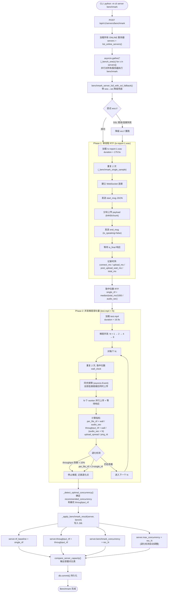
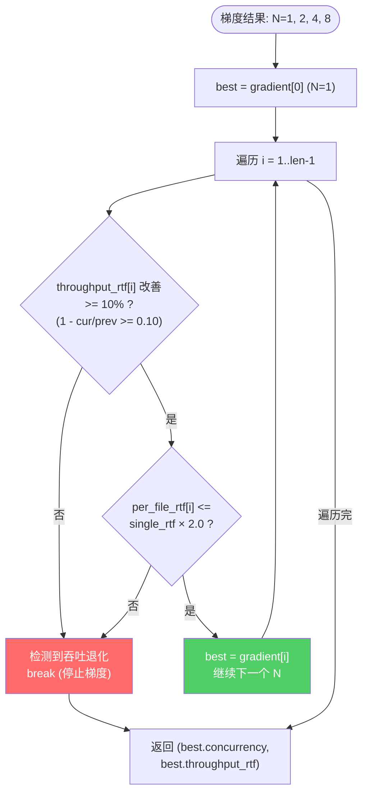
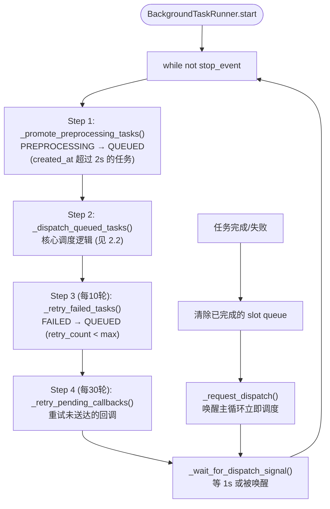
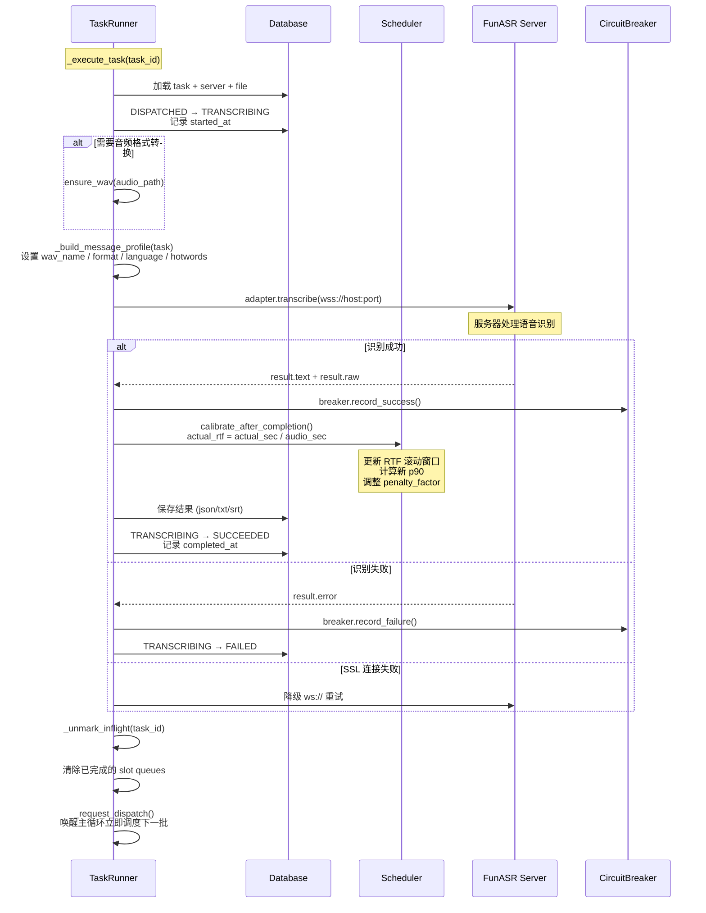
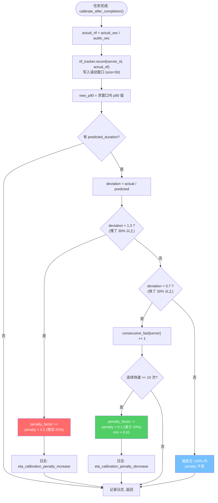
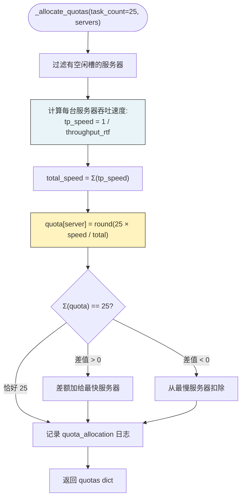

# Benchmark 流程图 & 调度策略时序图

> 基于 `server_benchmark.py`、`scheduler.py`、`task_runner.py`、`servers.py` 源码绘制

---

## 一、Benchmark 测试流程图

### 1.1 顶层入口：API `POST /api/v1/servers/benchmark`



### 1.2 并发测试同步屏障细节

```mermaid
sequenceDiagram
    participant M as Main (benchmark)
    participant W1 as Worker-1
    participant W2 as Worker-2
    participant W3 as Worker-3
    participant W4 as Worker-4
    participant S as FunASR Server

    Note over M,S: N=4 并发测试, 使用 test.mp4

    par 建立连接
        W1->>S: WebSocket connect + send start_msg
        W1->>M: ready_count += 1
    and
        W2->>S: WebSocket connect + send start_msg
        W2->>M: ready_count += 1
    and
        W3->>S: WebSocket connect + send start_msg
        W3->>M: ready_count += 1
    and
        W4->>S: WebSocket connect + send start_msg
        W4->>M: ready_count += 1
    end

    Note over M: ready_count == 4 → ready_event.set()
    M->>W1: fire_event.set() (屏障释放)
    M->>W2: fire_event.set()
    M->>W3: fire_event.set()
    M->>W4: fire_event.set()

    par 同步上传
        W1->>S: 上传 payload chunks + end_msg
    and
        W2->>S: 上传 payload chunks + end_msg
    and
        W3->>S: 上传 payload chunks + end_msg
    and
        W4->>S: 上传 payload chunks + end_msg
    end

    Note over S: 服务器并行处理 4 个请求

    par 等待响应
        W1<<--S: is_final response
        W2<<--S: is_final response
        W3<<--S: is_final response
        W4<<--S: is_final response
    end

    Note over M: 计算:<br/>upload_spread = max(upload_done) - min(upload_done)<br/>concurrent_post_upload = max(final_resp) - max(upload_done)
```

### 1.3 退化检测算法



---

## 二、调度策略时序图

### 2.1 TaskRunner 主循环



### 2.2 核心调度流程 `_dispatch_queued_tasks`

```mermaid
flowchart TD
    START(["_dispatch_queued_tasks()"]) --> LOAD_SRV["加载所有 ONLINE 服务器<br/>ServerInstance → ServerProfile"]
    LOAD_SRV --> LOAD_RT["rtf_baseline / throughput_rtf /<br/>penalty_factor 从 DB 读入"]
    LOAD_RT --> LOAD_TASK["加载 QUEUED 状态的任务<br/>(limit 200, order by created_at)"]
    LOAD_TASK --> LOAD_COUNT["查询 DISPATCHED+TRANSCRIBING 状态<br/>统计每台服务器 running_count"]
    LOAD_COUNT --> BUILD_PROF["构建 ServerProfile:<br/>running_tasks = running_count[server_id]<br/>free_slots = max_concurrency - running_tasks"]

    BUILD_PROF --> CB{"Circuit Breaker<br/>允许请求?"}
    CB -->|否| SKIP["跳过该服务器"]
    CB -->|是| HAS_TASK{"有待调度任务?"}
    HAS_TASK -->|否| END1([返回])
    HAS_TASK -->|是| CHECK_PLAN

    CHECK_PLAN{"需要重新规划?<br/>has_unplanned /<br/>servers_changed /<br/>queue_imbalanced"}
    CHECK_PLAN -->|是| CLEAR_Q["清除旧 slot queues"]
    CLEAR_Q --> BATCH_SCHED

    subgraph BATCH_SCHED ["schedule_batch() — 批量规划"]
        direction TB
        BS1["1. 筛选 ONLINE 服务器<br/>   计算每个 server 的 free slots"]
        BS1 --> BS2["2. _allocate_quotas():<br/>   tp_speed = 1 / throughput_rtf<br/>   quota = round(N × speed / total_speed)"]
        BS2 --> BS3["3. 估算每任务最优服务器:<br/>   est_time = audio_dur × rtf × (1+penalty×running)<br/>   + overhead(5s)"]
        BS3 --> BS4["4. LPT 排序: 按估算时间降序<br/>   (长任务优先分配)"]
        BS4 --> BS5["5. EFT 分配: 对每个任务<br/>   选 eligible_slots 中<br/>   earliest_free + est_time 最小的槽"]
        BS5 --> BS6["6. 更新 slot.earliest_free<br/>   输出 ScheduleDecision 列表"]
    end

    BATCH_SCHED --> BUILD_SQ["build_slot_queues()<br/>按 server:slot 分组<br/>形成有序队列"]
    BUILD_SQ --> PHASE_A

    CHECK_PLAN -->|否, 使用已有计划| PHASE_A

    subgraph PHASE_A ["Phase A: 从预规划队列分发"]
        direction TB
        PA1["遍历所有 slot queues"]
        PA1 --> PA2{"该 server 有空闲槽?"}
        PA2 -->|否| PA1
        PA2 -->|是| PA3["取队列头部 decision"]
        PA3 --> PA4["task.assigned_server_id = server_id<br/>task.eta_seconds = est_duration<br/>QUEUED → DISPATCHED"]
        PA4 --> PA5["free_slots[server] -= 1<br/>pop 队列头部"]
    end

    PHASE_A --> PHASE_B

    subgraph PHASE_B ["Phase B: Work Stealing 空闲窃取"]
        direction TB
        PB1["遍历仍有 free_slots 的服务器"]
        PB1 --> PB2["_find_steal_candidate():<br/>扫描其他服务器队列尾部<br/>找 improvement 最大的任务"]
        PB2 --> PB3{"找到可窃取任务?"}
        PB3 -->|否| PB1
        PB3 -->|是| PB4["将任务从源队列移到当前服务器<br/>重新计算 est_time<br/>DISPATCHED"]
        PB4 --> PB5["free_slots[server] -= 1"]
        PB5 --> PB1
    end

    PHASE_B --> EXEC["asyncio.create_task(_execute_task)<br/>为每个 to_start 任务创建协程"]
    EXEC --> END2([返回, 等 1s 或唤醒])

    style BATCH_SCHED fill:#e8f4f8,stroke:#333
    style PHASE_A fill:#fff3bf,stroke:#333
    style PHASE_B fill:#d3f9d8,stroke:#333
```



### 2.3 任务执行与 RTF 校准时序



### 2.4 RTF 校准与 Penalty 调整



### 2.5 Quota 分配算法



---

## 三、关键数据流总结

### 3.1 Benchmark 数据写入 → 调度读取

```
┌─────────────────────────────────────────────────────────┐
│  Benchmark (server_benchmark.py)                        │
│                                                         │
│  tv-report-1.wav ──→ single_rtf ──→ DB.rtf_baseline    │
│  test.mp4 × N   ──→ throughput_rtf → DB.throughput_rtf │
│  退化检测        ──→ recommended_N → DB.max_concurrency │
└──────────────────────┬──────────────────────────────────┘
                       │ DB commit
                       ▼
┌─────────────────────────────────────────────────────────┐
│  Scheduler (task_runner.py)                             │
│                                                         │
│  DB.rtf_baseline     → ServerProfile.rtf_baseline       │
│  DB.throughput_rtf   → ServerProfile.throughput_rtf     │
│  DB.max_concurrency  → ServerProfile.max_concurrency    │
│  DB.penalty_factor   → ServerProfile.penalty_factor     │
│                                                         │
│  tp_speed = 1 / throughput_rtf   → Quota 分配           │
│  effective_rtf = p90_rtf × (1+penalty×running)          │
│  est_time = audio_dur × effective_rtf + overhead(5s)    │
└──────────────────────┬──────────────────────────────────┘
                       │ 任务完成后
                       ▼
┌─────────────────────────────────────────────────────────┐
│  RTF 校准 (calibrate_after_completion)                  │
│                                                         │
│  actual_rtf = wall_time / audio_dur                     │
│  → 滚动窗口 p90 更新                                    │
│  → deviation = actual / predicted                       │
│  → penalty_factor 自适应调整 (±)                         │
│  (仅内存, 不回写 DB)                                    │
└─────────────────────────────────────────────────────────┘
```

### 3.2 一次 25 任务批处理的完整时序

```
时间线 ──────────────────────────────────────────────────────►

[CLI] 上传25文件 ──→ 创建25任务 ──→ 轮询等待 ──→ 下载结果

[DB]  PENDING → PREPROCESSING (2s) → QUEUED

[TR]  主循环检测到 25 个 QUEUED 任务:
      │
      ├─ schedule_batch():
      │   ├─ quota 分配: {10095:9, 10096:12, 10097:4}
      │   ├─ LPT 排序: tv-report-1.mp4 排前, test.mp4 排后
      │   └─ EFT 填入 slot queues
      │
      ├─ Phase A: 从 slot queues 分发首波
      │   └─ 7个任务 DISPATCHED (占满全部空闲槽)
      │
      ├─ Phase B: Work Stealing (本波无空闲, 跳过)
      │
      ├─ asyncio.create_task × 7 (并行执行)
      │   ├─ TRANSCRIBING → wss://server → SUCCEEDED
      │   └─ calibrate_after_completion()
      │
      ├─ 任务完成 → _request_dispatch() 唤醒主循环
      │
      ├─ 第二轮 dispatch:
      │   ├─ 检测 slot queues 有剩余计划 → 直接分发
      │   └─ 又分发 N 个任务...
      │
      ├─ ... 多轮接力 ...
      │
      └─ 最后一个任务完成 → 25/25 SUCCEEDED
```
